# 📘 Developer Handbook: Cloud Backend Monorepo

### What does this App do?

**Business Goal:**
This application is a **High-Compliance Pricing Microservice**.
It allows authorized systems (like a Web Frontend or Mobile App) to look up the current price of a product. However, because this is likely for a regulated industry (like Finance or Healthcare), it must strictly **Audit** every single lookup to answer the question: *"Who looked at this price, and when?"*

**Key Technical Functions:**

1. **Retrieves Data:** Fetches relational data (Prices, Currency) from a legacy SQL database (**Oracle**).
2. **Ensures Compliance:** Logs an immutable "Audit Trail" into a high-speed NoSQL database (**DynamoDB**).
3. **Validates Strictness:** Rejects any request that doesn't look perfect (using **Zod**).

---

### 🌊 The Data Journey (Step-by-Step)

Imagine a user named "Alice" clicks "Check Price" on the frontend. Here is exactly what happens to her data packet:

#### 1. The Entry (The Request)

* **Actor:** Client (Frontend/Postman)
* **Action:** Sends a GET request: `/price?id=PROD-101&userId=Alice-UUID`.
* **Gatekeeper:** **API Gateway** receives the request. It handles SSL termination and passes the packet to the Lambda.

#### 2. The Brain (The Lambda Handler)

* **Step A: Validation (Zod)**
* The Lambda wakes up.
* It asks: *"Is `id` alphanumeric? Is `userId` a valid UUID?"*
* *If Bad:* It stops immediately and returns `400 Bad Request`.
* *If Good:* It proceeds.


* **Step B: The Look-Up (Oracle)**
* The Lambda grabs a connection from the connection pool (managed by middleware).
* It sends a SQL query: `SELECT price FROM product_prices WHERE product_id = :id`.
* **Oracle** replies: `{ "price": 99.99, "currency": "USD" }` (or `null` if not found).


* **Step C: The Compliance Log (DynamoDB)**
* Regardless of the result, the Lambda **must** record this attempt.
* It constructs an Audit Item:
```json
{
  "pk": "USER#Alice-UUID",
  "sk": "AUDIT#2026-01-23T12:00:00Z",
  "action": "PRICE_FETCH",
  "status": "SUCCESS"
}

```


* It pushes this JSON to **DynamoDB**.


#### 3. The Exit (The Response)

* **Action:** The Lambda constructs a standardized JSON response.
* **Return:** It sends the object back to API Gateway, which serializes it to a string and sends it to Alice.

---

### 🖼️ Visual Data Flow Diagram

```mermaid
sequenceDiagram
    autonumber
    actor Client as 👤 User/Client
    participant APIG as 🚪 API Gateway
    participant Lambda as ⚡ Price Fetcher Lambda
    participant Oracle as 🛢️ Oracle DB (Prices)
    participant Dynamo as 📝 DynamoDB (Audit)

    Note over Client, APIG: HTTP GET /price?id=PROD-101

    Client->>APIG: Request Price
    APIG->>Lambda: Invoke Handler (JSON Event)

    activate Lambda
    
    %% Validation Phase
    Lambda->>Lambda: 🛡️ Validate Inputs (Zod)
    alt Invalid Input
        Lambda-->>Client: 400 Bad Request
    end

    %% Logic Phase
    Lambda->>Oracle: 🔍 SELECT price FROM products...
    activate Oracle
    Oracle-->>Lambda: Return Row {99.99, USD}
    deactivate Oracle

    %% Audit Phase
    Lambda->>Dynamo: ✍️ PutItem (Audit Log)
    activate Dynamo
    Dynamo-->>Lambda: Ack (Success)
    deactivate Dynamo

    %% Response Phase
    Lambda-->>APIG: Return { "price": 99.99 }
    deactivate Lambda

    APIG-->>Client: 200 OK (JSON)

```



---

### 🧩 Why this Architecture?

1. **Why Oracle?**
* **Reason:** "Relational Truth." Pricing data is often complex, relational, and requires strict consistency (ACID) found in SQL databases.


2. **Why DynamoDB?**
* **Reason:** "High-Volume Write." Audit logs can be massive. If 1 million users check prices, Oracle might choke on the inserts. DynamoDB handles massive write throughput easily and we can set a **TTL (Time-to-Live)** to auto-delete logs after 90 days to save money.


3. **Why Lambda?**
* **Reason:** "Bursty Traffic." Pricing checks happen sporadically. Lambda scales to 0 when no one is checking (saving money) and scales to 1,000s when a sale happens.
  

## 📂 Project Directory Structure

```text

lambda-monorepo/
├── 📁 .github/
│   └── workflows/
│       └── main.yml               # CI/CD Pipeline (Delegates to SRE Templates)
├── 📁 common/                        # 🧠 SHARED KERNEL (The "Glue" of the Monorepo)
│   ├── 📁 constants/                 # Magic strings (e.g., Error Codes, Table Names)
│   ├── 📁 middleware/                # Reusable logic (Logger, DB Connection, Header Normalizer)
│   ├── 📁 models/                    # Zod Schemas (Single source of truth for Data)
│   ├── 📁 scripts/                   # Utility scripts (Verification, Formatting)
│   ├── 📁 types/                     # TS Interfaces shared across boundaries
│   └── 📁 utils/                     # Clients (Oracle Pool, DynamoDB Client)
├── 📁 functions/                     # ⚡ MICROSERVICES
│   ├── 📁 price-fetcher/             # Feature: Product Price Lookup
│   │   ├── 📁 src/
│   │   │   ├── dto.ts             # Input Validation (Request Schema)
│   │   │   ├── handler.ts         # Controller (Middy chain, HTTP entry point)
│   │   │   ├── repository-*.ts    # Data Access (Oracle & Dynamo separated)
│   │   │   └── service.ts         # Pure Business Logic
│   │   └── 📁 tests/                 # Unit Tests
│   └── 📁 config-service/            # Feature: System Configuration
├── 📁 infra-local/                   # 🏗️ LOCAL SIMULATION (Docker & SAM)
│   ├── 📁 events/                    # JSON payloads for local testing
│   ├── 📁 seed/                      # SQL and TS scripts to populate local DBs
│   ├── docker-compose.yml         # Defines Oracle & DynamoDB containers
│   └── local-debug.yaml           # SAM Template for local invocation
├── .gitignore
├── esbuild.config.js              # Bundler config (Optimizes TS -> JS for Lambda)
├── jest.config.js                 # Test runner configuration
├── package.json                   # Dependencies & "npm run" scripts
├── setup.js                       # One-click project scaffolder
└── tsconfig.json                  # TypeScript compiler rules

```
---

### 📋 Folders & Files Responsibilities

| Folder/File | Responsibility | Use Case |
| :--- | :--- | :--- |
| **`.github/workflows`** | **CI/CD Pipeline Configuration**<br>Defines the automation logic for testing, building, and deploying the application. | Used automatically by GitHub when code is pushed to `main` or when a "Promote" button is clicked to deploy to QA/Prod. |
| **`common/middleware`** | **Cross-Cutting Logic**<br>Contains shared code that wraps around Lambda handlers (Logging, Error Handling, DB Connection). | Used to inject the Oracle connection into the context or to ensure every log line has a standard JSON format. |
| **`common/models`** | **Data Contracts (Schema)**<br>Single source of truth for data structures using Zod. | Used by both the Database Repositories (to save data) and the API (to validate incoming requests) to ensure consistency. |
| **`common/scripts`** | **Dev & CI Tooling**<br>Helper scripts for local development and CI verification. | `verify-deployment.ts` is run by the CI pipeline to "smoke test" a deploy. `format-response.js` is run by developers to read JSON in the terminal. |
| **`common/utils`** | **Infrastructure Clients**<br>Singleton instances for connecting to external services. | Used to get a connection from the Oracle Pool or to switch the DynamoDB client between "Localhost" and "Real AWS" modes. |
| **`functions/[name]/src`** | **Microservice Source Code**<br>Contains the specific logic for a single function (e.g., Price Fetcher). | Developers work here daily to add features. This is the only code that changes when business requirements change. |
| **`.../src/handler.ts`** | **The Controller**<br>The entry point for the Lambda. Handles HTTP request/response and middleware wiring. | Used to parse the incoming event, run validation, and catch errors before they crash the Lambda. |
| **`.../src/service.ts`** | **The Business Logic**<br>Pure functions that make decisions based on data. | Used to calculate the final price or decide if a user is allowed to see data. Isolated for easy Unit Testing. |
| **`.../src/repository.ts`** | **The Data Access Layer**<br>Handles all SQL queries and DynamoDB commands. | Used whenever the app needs to talk to a database. Prevents SQL injection and handles DB-specific errors. |
| **`infra-local`** | **Local Simulation Environment**<br>Configuration for running the cloud stack on a laptop. | Used during the "Inner Loop" of development to run `npm run dev:env` and spin up local databases. |
| **`infra-local/docker-compose.yml`** | **Container Definition**<br>Defines the Oracle XE and DynamoDB Local images and networking. | Used to start the databases with a single command (`docker-compose up`) ensuring everyone uses the same DB version. |
| **`infra-local/local-debug.yaml`** | **SAM Template**<br>Tells AWS SAM how to run the Lambda locally. | Used by `sam local invoke` to inject environment variables (like `ORACLE_HOST=host.docker.internal`) that are unique to the local machine. |
| **`esbuild.config.js`** | **Build Configuration**<br>Settings for compiling and bundling TypeScript. | Used during `npm run build` to convert readable TypeScript into a single, minified `index.js` file for the Lambda runtime. |
| **`setup.js`** | **Project Scaffolding**<br>A script to create the folder structure from scratch. | Used only once when initializing the project or when a new developer joins and needs to verify their structure. |
| **`package.json`** | **Dependency & Script Manager**<br>Lists libraries and defines shortcut commands. | Used to install tools (`npm install`) and run common tasks like `npm run invoke:price` or `npm test`. |

---

## 🛠 Development Environment Setup

### Prerequisites

Before starting, ensure your local machine has the following installed:

* **Node.js v18+** (v20 recommended)
* **Docker Desktop** (Must be running to simulate databases)
* **AWS SAM CLI** ([Installation Guide](https://docs.aws.amazon.com/serverless-application-model/latest/developerguide/serverless-sam-cli-install.html))
* **AWS CLI** (Configured with any dummy credentials for local use)

### Step 1: Install Dependencies

Run this at the root of the project to install the compiler, build tools, and shared libraries.

```bash
npm install
```

### Step 2: Spin Up Local Infrastructure

This project uses Docker to simulate the cloud environment (Oracle and DynamoDB).

```bash
# Start the containers and seed the data automatically
npm run dev:env
```

## 🚀 Development Workflow

To develop and debug your Lambda functions locally without touching AWS, we will use a combination of **Docker** (to simulate the database layer) and **AWS SAM CLI** (to simulate the Lambda runtime).

Here is the step-by-step workflow.

### The Local Architecture

We replicate the cloud environment on your laptop.

* **Lambda:** Simulated by AWS SAM (Serverless Application Model).
* **Oracle:** Simulated by the `gvenzl/oracle-xe` Docker container.
* **DynamoDB:** Simulated by the `amazon/dynamodb-local` Docker container.
* **Network:** SAM containers and Database containers communicate via a bridge network (`host.docker.internal`).

### Workflow Steps 
#### Summary of Commands

| Goal | Command |
| --- | --- |
| **Start DBs** | `npm run dev:env` |
| **Test "Price Fetcher"** | `npm run invoke:price` |
| **Run Unit Tests** | `npm test` |
| **Stop Everything** | `npm run db:stop` |

#### Step 1: Start the Infrastructure

Open a terminal in your project root. Run the custom script defined in your `package.json`.

```bash
npm run dev:env
```

**What happens?**

1. `docker-compose up` starts the Oracle and DynamoDB containers.
2. The script waits 10 seconds (giving Oracle time to boot).
3. It runs `seed-dynamo.ts` to create the "Audit_Logs_Local" table.
4. Oracle initializes automatically using the SQL file mounted in `docker-compose.yml`.

#### Step 2: Run a Request (The "Invoke")

To test your code, you don't need to deploy. You just "invoke" it against the local infrastructure.

```bash
npm run invoke:price
```

**What happens?**

1. **Build:** Runs `esbuild` to compile your TypeScript into `dist/`.
2. **SAM Invoke:**
* Reads `infra-local/local-debug.yaml`.
* Spins up a temporary Docker container mimicking the AWS Lambda environment.
* Mounts the compiled code.
* Injects the environment variables (`ORACLE_HOST=host.docker.internal`).
* Sends the JSON payload from `infra-local/events/price-event.json`.


3. **Result:** You see the JSON response in your terminal.

```json
{"statusCode":200,"body":"{\"productId\":\"PROD-101\",\"price\":99.99,\"currency\":\"USD\"}"}

```

### The "Build-Invoke" Cycle

Because AWS Lambda runs JavaScript, you must compile your TypeScript before testing.

1. **Modify code** in `functions/`.
2. **Build:** `npm run build` (bundles files into the `/dist` folder).
3. **Test:** `npm run test` (executes Jest unit tests with mocks)
4. **Invoke:** `npm run invoke:price` (runs the function locally via SAM).

### Database Seeding

* **Oracle:** Automatically seeds via `infra-local/seed/01_oracle_init.sql` when the container first starts.
* **DynamoDB:** Seeds via `npm run db:seed`. This script creates the tables and inserts mock JSON items.

### Testing

* **Unit Tests:** Run `npm test` to execute Jest. These tests use mocks, so no Docker is required.
* **Integration Tests:** Use `npm run invoke:<service_name>` to test the full flow from Handler → Service → Docker DB.

---
## 🛰️ API Gateway Simulation & Local Testing

Because your Lambdas are designed to sit behind an AWS API Gateway, they expect a specific JSON "Proxy Event" structure (containing headers, query parameters, and a stringified body). You cannot simply run the code with `node index.js`.

### A. Testing via Event Injection (Recommended for CI/CD & Fast Iteration)

This method injects a "frozen" JSON event directly into your Lambda. It is the fastest way to test specific scenarios (e.g., a missing User ID).

**1. The Event File:**
In `infra-local/events/price-event.json`, we store a mock API Gateway request:

```json
{
  "httpMethod": "GET",
  "queryStringParameters": {
    "id": "PROD-101",
    "userId": "550e8400-e29b-41d4-a716-446655440000"
  },
  "requestContext": {
    "requestId": "local-test-id"
  }
}
```

**2. The Execution:**

```bash
# This uses SAM to "wrap" your code in the official Lambda Docker image 
# and feeds it the JSON event above.
npm run invoke:price
```


### Testing via Local API Server (Recommended for Frontend Integration)

If you want to test your Lambda using **Postman** or a **Browser**, you can tell SAM to host a local HTTP server that behaves exactly like API Gateway. 

**1. Start the Local Server:**

```bash
cd infra-local
sam local start-api -t local-debug.yaml --warm-containers EAGER

```

**2. Send a Request:**
The server will start on `http://127.0.0.1:3000`. You can now use Postman to hit your endpoints:

* **GET** `http://127.0.0.1:3000/price?id=PROD-101&userId=xxx`

### Generating New Mock Events

We use JSON files in `infra-local/events/` to simulate HTTP requests.

* **Usage:** SAM reads this file and "injects" it into your handler as the `event` object.

If you create a new Lambda (e.g., a POST request for Salesforce or an API), you can generate a valid API Gateway mock event using the SAM CLI:

```bash
# Generates a boilerplate API Gateway Proxy event
sam local generate-event apigateway aws-proxy > infra-local/events/new-service-event.json
```
---

### Step-by-Step: Debugging (Breakpoints) 🐞

Console logs are fine, but sometimes you need to inspect variables line-by-line.

#### Configure VS Code

Create/Update the `.vscode/launch.json` file(already have an example in this repo). This tells VS Code how to attach to the SAM debugger.

#### Run the Debug Session

1. **Terminal:** Run the invoke command with the debug flag (`-d`).
```bash
# This compiles the code and waits on port 5858
npm run build && cd infra-local && sam local invoke -t local-debug.yaml -e events/price-event.json -d 5858 PriceFetcherLocal
```

*Output:* `Debugger listening on ws://0.0.0.0:5858/...`

**VS Code:**
* Open `functions/price-fetcher/src/service.ts`.
* Click the **Red Dot** in the margin to set a breakpoint.
* Go to the **Run and Debug** tab (Play icon with a bug).
* Select **"Attach to SAM Local"** and press Play.


**Result:**
* The terminal will resume execution.
* VS Code will **freeze** at your breakpoint.
* You can hover over variables like `productId` or `oracle` to see their values locally!

#### Troubleshooting Local Issues

| Issue | Likely Cause | Solution |
| --- | --- | --- |
| **"Connection Refused"** | Lambda container cannot see `localhost`. | Ensure `local-debug.yaml` uses `host.docker.internal` for DB hosts. |
| **"Table Not Found"** | DynamoDB Local is in-memory only. | If you restarted the container, run `npm run db:seed` to recreate tables. |
| **"Handler Not Found"** | You didn't compile the latest code. | Always run `npm run build` before invoking SAM. |
| **"Process exited with code 1"** | TypeScript compilation error. | Check your terminal for `esbuild` errors (missing types, syntax errors). |

---

## 🔑 Environment Variables & Secret Management

This project uses environment variables to switch between local and cloud resources.

| Variable | Source (Local) | Source (Cloud/Terraform) | Purpose |
| --- | --- | --- | --- |
| `AWS_SAM_LOCAL` | Set to `true` in SAM | Not set | Used by `common/utils` to point to Docker. |
| `ORACLE_HOST` | `host.docker.internal` | RDS/OCI Private IP | The address of the Oracle DB. |
| `TABLE_AUDIT` | `Audit_Logs_Local` | Terraform Output | The DynamoDB table name for audit trails. |
| `ORACLE_USER` | `app_user` | AWS Secrets Manager | Database credentials. |

> **Note:** In the local environment, these variables are managed inside `infra-local/local-debug.yaml`. In Production, the SRE team injects these via Terraform into the Lambda configuration.

---

## 👮 Security & Compliance Rules

To maintain **HIPAA/FDA** compliance, every developer must follow these rules:

1. **No Plain SQL:** Never use string concatenation for queries. Always use **Bind Variables** in the repository layer.
2. **Validation:** Every request must be validated by **Zod** in the `handler` or `schema` file.
3. **Audit Logs:** Every "Read" from Oracle must trigger a corresponding "Audit Write" to DynamoDB.
4. **Logging:** Never log PII (Personal Identifiable Information). Use the `logger` utility to ensure logs are structured but clean.

---

## Dev Pipeline Workflow in this Repo

We will create a single **Reusable Workflow** in the SRE repo that handles **everything**: Setup, Testing, Building, and Deploying.

**The Contract:**
The Dev team only needs to promise one thing:

> *"My code lives in `functions/<service-name>` and I have a `package.json` script."*


### Master Lifecycle (Who Does What?)

This table defines the "Rules of Engagement" for the entire team, ensuring everyone knows their responsibility at each stage of the pipeline.

| Phase | Environment | Actor | Action | Trigger | Goal |
| --- | --- | --- | --- | --- | --- |
| **1. Code** | Local | **Dev** | Writes code, runs `npm run invoke`, opens PR. | Manual | Unit Verification. |
| **2. Review** | CI (GitHub) | **Peer / Lead** | Reviews PR. GitHub runs `ci-check` (Tests/Lint). | Open PR | Code Quality Gate. |
| **3. Merge** | **DEV** | **Dev** | Merges PR to `main`. | Auto (Push) | Integration Check. |
| **4. Verify** | **DEV** | **System** | Runs `verify-deployment.ts`. Alerts if Dev is broken. | Auto | Smoke Test (Circuit Breaker). |
| **5. Promote** | N/A | **Dev / Lead** | Clicks **"Promote to QA"** in GitHub Actions. | Manual | Create Stable Snapshot. |
| **6. Test** | **QA** | **QA Team** | Runs E2E tests against `v1.0-qa.1`. Checks for bugs. | Auto (Tag) | Functional Sign-off. |
| **7. Promote** | N/A | **Team Lead** | Clicks **"Promote to UAT"** in GitHub Actions. | Manual | Graduate to Release Candidate. |
| **8. UAT** | **UAT** | **Product Owner** | Log in to UAT App (`v1.0-rc.1`). Verifies business value. | Auto (Tag) | Business Sign-off. |
| **9. Release** | N/A | **Lead / SRE** | Clicks **"Promote to PROD"** in GitHub Actions. | Manual | Authorize Go-Live. |
| **10. Live** | **PROD + DR** | **System** | Deploys `v1.0.0` to US-East-1 (Primary) and US-West-2 (Replica). | Auto (Tag) | **Value Delivery.** |

### 🔍 Key Definitions for the Team

* **QA (Internal):** Technical testing. Does the button work? Does it crash?
* **UAT (External/Business):** Value testing. Is the button the right color? Does this solve the user's problem?
* **Release Candidate (`-rc`):** A version in UAT that is *identical* to what will go to Production. No code changes allowed here.

---

## 📘 10. CI/CD Workflow Reference

**The Correct Structure (The "Vault"):**
We use **S3 Prefixes (Folders)** to organize everything in a single, secure bucket.

```text
s3://my-org-artifacts-vault/
├── v1.0.0/                        <-- The Tag (The "Box")
│   ├── price-fetcher.zip          <-- The Immutable Artifact
│   └── config-service.zip
├── v1.0.1/
│   ├── price-fetcher.zip
│   └── config-service.zip

```

* **The Logic:**
1. Developer merges code.
2. CI System says: "This is Release `v1.0.0`".
3. It builds the Zips and puts them in the `v1.0.0` folder in S3.
4. **Crucial:** The tag exists *before* Dev, QA, or Prod are touched.
5. When we deploy to QA, we tell AWS: *"Go get the zips from folder `v1.0.0`."*
6. When we deploy to Prod, we tell AWS: *"Go get the zips from folder `v1.0.0`."*

**We tag the Artifact, not the Environment.**

---

### 📘 The CI/CD Workflow Reference Manual

> **For:** Developers, QA, SREs
> **Purpose:** Defines the exact sequence of events for every stage.

#### 🟢 PHASE 1: The Factory (CI & Dev)

* **Goal:** Verify code integrity and create the Immutable Artifact.
* **Trigger:** Push to `main` branch.

| Step | Actor | Action | Technical Detail |
| --- | --- | --- | --- |
| **1.1** | **Dev** | Merges Pull Request. | `git push origin main` |
| **1.2** | **GitHub** | Calculates Version. | Detects `fix:` or `feat:`. Bumps version (e.g., `v1.0.0`). |
| **1.3** | **GitHub** | **Builds & Zips.** | Runs `npm run build`. Zips `dist/` folder. |
| **1.4** | **GitHub** | **Uploads to Vault.** | Uploads to `s3://vault/v1.0.0/service.zip`. |
| **1.5** | **GitHub** | **Deploys to DEV.** | Calls `aws lambda update-function-code` using the S3 link. |
| **1.6** | **GitHub** | **Smoke Test.** | Runs `verify-deployment.ts` against Dev API. |
| **1.7** | **System** | Decision Point. | If Smoke Test **PASS** → Proceed to Phase 2.<br>

<br>If Smoke Test **FAIL** → **STOP PIPELINE.** |

#### 🟡 PHASE 2: Quality Assurance (QA)

* **Goal:** Verify business logic functionality.
* **Trigger:** Automatic (immediately after Phase 1 success).

| Step | Actor | Action | Technical Detail |
| --- | --- | --- | --- |
| **2.1** | **GitHub** | **Deploys to QA.** | Uses the **EXACT SAME** S3 link (`s3://vault/v1.0.0/service.zip`). |
| **2.2** | **GitHub** | Smoke Test. | Runs `verify-deployment.ts` against QA API. |
| **2.3** | **QA Team** | Notification. | Slack/Email alert: "v1.0.0 is live in QA." |
| **2.4** | **QA Team** | **Manual/Auto Testing.** | QA runs Selenium/Cypress suites. |
| **2.5** | **QA Lead** | **Sign Off.** | If satisfied, QA Lead clicks "Approve" in GitHub for the UAT Gate. |

#### 🟠 PHASE 3: User Acceptance (UAT)

* **Goal:** Business stakeholder validation.
* **Trigger:** Manual Approval by QA Lead.

| Step | Actor | Action | Technical Detail |
| --- | --- | --- | --- |
| **3.1** | **GitHub** | **Deploys to UAT.** | Downloads `v1.0.0` from Vault. Updates UAT Lambdas. |
| **3.2** | **PO** | Validation. | Product Owner tests new features in the UAT environment. |
| **3.3** | **Manager** | **Go/No-Go Decision.** | Manager reviews UAT feedback. |
| **3.4** | **Manager** | **Production Approval.** | Manager clicks "Approve" on the **PROD Gate** in GitHub. |

#### 🔴 PHASE 4: Production (PROD)

* **Goal:** Live Release & Compliance.
* **Trigger:** Manual Approval by Manager.

| Step | Actor | Action | Technical Detail |
| --- | --- | --- | --- |
| **4.1** | **GitHub** | **Deploys to PROD.** | Updates Production Lambdas with `v1.0.0`. |
| **4.2** | **GitHub** | Smoke Test. | Runs `verify-deployment.ts` (Safe Read-Only checks) on Prod. |
| **4.3** | **GitHub** | **Triggers DR Sync.** | Fires the `workflow_run` event ("Prod Success"). |

#### 💾 PHASE 5: Disaster Recovery (DR)

* **Goal:** Maintain RTO (Recovery Time Objective).
* **Trigger:** Async Event (After Prod Success).

| Step | Actor | Action | Technical Detail |
| --- | --- | --- | --- |
| **5.1** | **Robot** | Wakes Up. | `dr-sync.yml` starts. |
| **5.2** | **Robot** | Fetches Artifact. | Downloads `v1.0.0` from the Vault. |
| **5.3** | **Robot** | **Deploys to West.** | Updates `us-west-2` Lambdas. |
| **5.4** | **System** | Audit Log. | Marks Release `v1.0.0` as "Globally Synced". |

---

### 📘 The Immutable Delivery Pipeline Reference

**Visual Legend:**

* 🟩 **Automated Zone:** The "fast lane". Code moves instantly if tests pass.
* 🟧 **Human Control Zone:** The pipeline physically stops and waits for an authorized signature.
* 🟨 **The Vault (S3):** The single source of truth. The artifact here never changes.
* ⬜ **Async/Backup:** Happens in the background without blocking the main flow.

```mermaid
flowchart TD
    %% ==========================================
    %% STYLING DEFINITIONS
    %% ==========================================
    classDef actor fill:#1e293b,stroke:#334155,stroke-width:2px,color:#fff,rx:10,ry:10;
    classDef factory fill:#dcfce7,stroke:#16a34a,stroke-width:2px,color:#064e3b,rx:5,ry:5;
    classDef vault fill:#fef3c7,stroke:#d97706,stroke-width:3px,color:#78350f,rx:5,ry:5,stroke-dasharray: 5 5;
    classDef autoEnv fill:#e0f2fe,stroke:#0284c7,stroke-width:2px,color:#075985,rx:5,ry:5;
    classDef gate fill:#ffedd5,stroke:#f97316,stroke-width:3px,color:#7c2d12,rx:5,ry:5,shape:diamond;
    classDef manualEnv fill:#fce7f3,stroke:#db2777,stroke-width:2px,color:#831843,rx:5,ry:5;
    classDef prodEnv fill:#fee2e2,stroke:#dc2626,stroke-width:3px,color:#7f1d1d,rx:5,ry:5;
    classDef drEnv fill:#f3f4f6,stroke:#6b7280,stroke-width:2px,color:#374151,rx:5,ry:5;
    classDef brake fill:#fee2e2,stroke:#b91c1c,stroke-width:2px,rx:10,ry:10,color:#b91c1c;

    %% ==========================================
    %% ACTORS
    %% ==========================================
    Dev[👷 Developer]:::actor
    QALead[🕵️ QA Lead]:::actor
    Manager[💼 Manager]:::actor

    %% ==========================================
    %% THE CENTRAL VAULT
    %% ==========================================
    subgraph VAULT_ZONE ["🏆 The Immutable Vault (S3 Storage)"]
        Vault[("📦 Locked Artifact<br/>Tag: v1.0.0<br/>Checksum: a1b2c3")]:::vault
    end

    %% ==========================================
    %% PHASE 1: THE FACTORY (CI)
    %% ==========================================
    subgraph P1 ["🟢 PHASE 1: The Factory (Build Once)"]
        direction TB
        Commit(["💻 Push Code"]) --> Build["🏭 Build & Tag v1.0.0"]:::factory
        Build --> Upload["⬆️ Upload to Vault"]:::factory
    end

    %% ==========================================
    %% MAIN DELIVERY TRACK
    %% ==========================================
    subgraph TRACK ["🚀 The Delivery Track"]
        direction LR

        %% PHASE 2: AUTOMATED TRAIN
        subgraph P2 ["Phase 2: Automated Validation"]
            direction TB
            DevEnv["☁️ DEV Environment"]:::autoEnv
            SmokeDev{"⚡ Smoke Test"}:::brake
            QAEnv["☁️ QA Environment"]:::autoEnv
            SmokeQA{"⚡ Smoke Test"}:::brake
            
            DevEnv --> SmokeDev
            SmokeDev -->|✅ Pass| QAEnv
            QAEnv --> SmokeQA
        end

        %% PHASE 3: BUSINESS GATE
        subgraph P3 ["Phase 3: Business Acceptance"]
            direction TB
            GateUAT{"🛑 QA Gate<br/>Click to Approve"}:::gate
            UATEnv["👓 UAT Environment<br/>Feature Review"]:::manualEnv
            
            GateUAT -->|Approved| UATEnv
        end

        %% PHASE 4: PRODUCTION
        subgraph P4 ["Phase 4: Live Release"]
            direction TB
            GatePROD{"🛑 Compliance Gate<br/>Click to Approve"}:::gate
            ProdEnv["🚀 PROD Environment<br/>US-East Primary"]:::prodEnv
            
            GatePROD -->|Approved| ProdEnv
        end
    end

    %% ==========================================
    %% CONNECTIONS & FLOW
    %% ==========================================
    Dev --> Commit
    Upload ====> Vault

    %% PULLS from Vault
    Vault -.-|⬇️ Fetch v1.0.0| DevEnv
    Vault -.-|⬇️ Fetch v1.0.0| QAEnv
    Vault -.-|⬇️ Fetch v1.0.0| UATEnv
    Vault -.-|⬇️ Fetch v1.0.0| ProdEnv

    %% Track Progression
    SmokeQA ====>|Ready for UAT| GateUAT
    UATEnv ====>|Ready for Prod| GatePROD

    %% Human Actors
    QALead -..-> GateUAT
    Manager -..-> GatePROD

    %% ASYNC DR (Simplified Label)
    ProdEnv -.->|⚡ Trigger Event: Success| DREnv["💾 DR Environment<br/>US-West Backup"]:::drEnv
    Vault -.-|⬇️ Fetch v1.0.0 Async| DREnv

    %% Brakes
    SmokeDev -- "❌ Fail Stop" --> Stop1["⛔ Pipeline Halted"]:::brake
    SmokeQA -- "❌ Fail Stop" --> Stop2["⛔ Pipeline Halted"]:::brake

    %% ==========================================
    %% STYLING ADJUSTMENTS
    %% ==========================================
    linkStyle 3,7,8,9,10 stroke:#d97706,stroke-width:2px,stroke-dasharray: 5 5;
    linkStyle 4,11,12 stroke:#334155,stroke-width:4px;
    linkStyle 15 stroke:#6b7280,stroke-width:2px,stroke-dasharray: 2 2;
```


### How to explain this diagram to a PM or Executive:

1. **The Vault is the Hero:** Point to the yellow cylinder in the middle. "See this box labeled `v1.0.0`? We create it once. We never open it, we never change it. Every environment is just borrowing this exact same box."
2. **The Fast Lane (Green):** "Once a developer pushes code, it automatically rushes to DEV and QA. If our automated safety checks (the red stop signs) pass, it lands on the QA team's desk in minutes."
3. **The Control Gates (Orange Diamonds):** "The pipeline physically stops here. Nothing goes to UAT or Prod until the designated person (QA Lead or Manager) clicks the 'Approve' button in the system. This is our compliance audit trail."
4. **Disaster Recovery is Automatic (Grey):** "When Prod goes live successfully, the system automatically wakes up and syncs our backup site in the background. No human effort required."

### 📊 Visual Reference: The Artifact Journey

This diagram clarifies exactly how **One Bucket** feeds **Five Environments**.

```mermaid
flowchart TD
    %% DEFINITIONS
    classDef bucket fill:#fef3c7,stroke:#d97706,stroke-width:2px;
    classDef env fill:#e0f2fe,stroke:#0284c7,stroke-width:2px;
    classDef tag fill:#dcfce7,stroke:#16a34a,stroke-width:2px;

    %% THE VAULT
    subgraph VAULT ["🏆 The S3 Vault (Shared)"]
        direction TB
        Zip["📦 v1.0.0/app.zip
        (Created: 10:00 AM)"]:::bucket
    end

    %% TIMELINE
    subgraph TIME ["⏳ Deployment Timeline"]
        direction TB
        
        T1["10:05 AM
        Deploy DEV"]:::env
        T2["10:10 AM
        Deploy QA"]:::env
        T3["2:00 PM
        Deploy UAT"]:::env
        T4["Friday
        Deploy PROD"]:::env
    end

    %% FLOW
    Zip -->|Read Only| T1
    Zip -->|Read Only| T2
    Zip -->|Read Only| T3
    Zip -->|Read Only| T4

    %% ANNOTATIONS
    T1 -.-> Verify1[✅ Validated]:::tag
    T2 -.-> Verify2[✅ Validated]:::tag
    T3 -.-> Verify3[✅ Validated]:::tag
    
    linkStyle 0,1,2,3 stroke:#d97706,stroke-width:2px;

```



### ✅ Key Takeaways for the Team

1. **Devs:** You push code. If it passes Dev/QA, your job is done.
2. **QA:** You don't "build" anything. You just approve what's already there.
3. **SREs:** You manage the Vault permissions. You ensure Prod can read from the Vault, but Dev cannot overwrite existing versions in the Vault.

### 🪦 The Release Graveyard Visualization

This diagram demonstrates the **"Fail Forward"** strategy: when `v1.0.0` dies in QA, we don't fix it; we abandon it and create `v1.0.1`.

This view allows your team to audit exactly *where* and *when* specific versions died.

```mermaid

flowchart TD
    %% ==========================================
    %% STYLING
    %% ==========================================
    classDef success fill:#dcfce7,stroke:#16a34a,stroke-width:2px,color:#064e3b,rx:5,ry:5;
    classDef fail fill:#fee2e2,stroke:#dc2626,stroke-width:2px,color:#7f1d1d,rx:5,ry:5;
    classDef active fill:#e0f2fe,stroke:#0284c7,stroke-width:3px,color:#075985,rx:5,ry:5;
    classDef dead opacity:0.6,fill:#f3f4f6,stroke:#9ca3af,stroke-width:2px,stroke-dasharray: 5 5;

    %% ==========================================
    %% ATTEMPT 1
    %% ==========================================
    subgraph V1 ["🗓️ Attempt 1: v1.0.0 (Died in QA)"]
        direction TB
        B1[Build v1.0.0]:::success --> D1[Dev: Pass]:::success
        D1 --> Q1["QA: ❌ FAILED"]:::fail
        Q1 -.-> G1("🪦 GRAVEYARD
        (Abandoned)"):::dead
    end

    %% ==========================================
    %% ATTEMPT 2
    %% ==========================================
    subgraph V2 ["🗓️ Attempt 2: v1.0.1 (Died in UAT)"]
        direction TB
        B2[Build v1.0.1]:::success --> D2[Dev: Pass]:::success
        D2 --> Q2[QA: Pass]:::success
        Q2 --> U2["UAT: 🛑 REJECTED
        (Biz Logic Error)"]:::fail
        U2 -.-> G2("🪦 GRAVEYARD
        (Abandoned)"):::dead
    end

    %% ==========================================
    %% ATTEMPT 3
    %% ==========================================
    subgraph V3 ["🗓️ Attempt 3: v1.0.2 (Success)"]
        direction TB
        B3[Build v1.0.2]:::success --> D3[Dev: Pass]:::success
        D3 --> Q3[QA: Pass]:::success
        Q3 --> U3[UAT: Approved]:::success
        U3 --> P3["🚀 PROD: LIVE"]:::active
    end

    %% Connect the attempts to show sequence
    V1 --> V2 --> V3

```



### How to Read This Dashboard

1. **Row 1 (`v1.0.0`):** The code compiled and worked in Dev. However, the automated tests in QA found a bug. The pipeline stopped. The artifact sits in S3 (the "Graveyard") for forensic analysis but was never promoted further.
2. **Row 2 (`v1.0.1`):** A developer fixed the QA bug. It passed Dev and QA. However, during UAT, the Product Owner realized a feature was wrong (Business Logic). They rejected the deployment. This version is also dead.
3. **Row 3 (`v1.0.2`):** The logic was corrected. It passed every gate (Dev  QA  UAT) and was finally approved for Production.

### 💡 Why this is great for Auditors

Auditors love this because it proves **Negative Testing**:

* *"Show me evidence that you block bad code."*
* *You point to `v1.0.0`:* "Here is the proof. The system detected a failure in QA and physically prevented the code from reaching Production."

---

## 📈 10. Monitoring, Compliance & FinOps

We adhere to the **AWS Well-Architected Serverless Lens**. Our strategy prioritizes **Compliance** (Security & Auditability) while leveraging **FinOps** (Cost Awareness) to minimize the Total Cost of Ownership (TCO).

### A. The Observability Stack

We use a **Serverless-Native** stack to avoid managing monitoring infrastructure.

| Component | Tool | Purpose | FinOps Strategy |
| --- | --- | --- | --- |
| **Logs** | **CloudWatch Logs** | Application errors, debugging info. | Retention policies prevent "Zombie Data" costs. |
| **Metrics** | **CloudWatch EMF** | Business KPIs (e.g., "Price Fetched"). | Uses Embedded Metric Format (EMF) to avoid API costs. |
| **Tracing** | **AWS X-Ray** | Performance bottlenecks & Latency. | Enabled only in Prod with 5% sampling. |
| **Audit** | **DynamoDB** | Immutable record of *who* accessed *what*. | TTL (Time-To-Live) automatically deletes old records. |

### B. HIPAA/FDA Compliance Strategy

To meet regulatory standards, we enforce the following strictly in the code (`common/middleware/logger.ts`) and infrastructure:

1. **No PII in Logs:** The logger is configured to never output sensitive fields (like `ssn`, `patient_name`, or raw `auth_tokens`). We log *Process IDs* (e.g., `request_id`), not *Personal Data*.
2. **Immutable Audit Trail:** While CloudWatch tracks *debug* info, **DynamoDB** tracks *access* info.
* *Rule:* Every "Read" from Oracle triggers a "Write" to the Audit Table.
* *Compliance:* This table allows us to answer: *"Who accessed Patient X's data on Date Y?"*

3. **Data Retention:**
* **Dev Logs:** 7 Days (Aggressive cleanup to save space).
* **Prod Audit Logs:** 6 Years (or strict regulatory requirement), managed via DynamoDB TTL and S3 Archiving.

### C. FinOps Principles (Why not Prometheus?)

You might ask: *"Why not use Prometheus/Grafana?"*

1. **Zero Idle Cost:** CloudWatch costs (0.00) when traffic is zero. Managed Prometheus has a base cost (~$100/mo) regardless of traffic. For our current scale (<100 Lambdas), CloudWatch is significantly cheaper.
2. **Cost Controls in Code:**
* **EMF (Embedded Metric Format):** We do not make `PutMetricData` API calls (which cost money). We print metrics to standard logs, and AWS extracts them for free.
* **Sampling:** X-Ray tracing is expensive at 100%. We configure it to sample only **5% of traffic** in Production, giving us statistical significance at 1/20th of the cost.