# 📘 Developer Handbook: Cloud Backend Monorepo

This repository is a production-grade TypeScript monorepo for AWS Lambda services. It follows a **Shared Core** architecture to ensure that security, database connectivity, and observability (HIPAA/FDA compliant) are consistent across all services.

## 📂 Project Directory Structure

```text
/dev-application-monorepo
├── 📁 common/                 # SHARED CORE: Logic used by all services
│   ├── 📁 middleware/         #   - Onion layers: withDbConnection, Logger, Zod validation
│   ├── 📁 utils/              #   - Global clients: Oracle Pool, DynamoDB Client
│   ├── 📁 types/              #   - Shared TypeScript interfaces and contracts
│   └── 📁 constants/          #   - Application-wide error codes and enums
├── 📁 functions/              # MICROSERVICES: Independent business units
│   ├── 📁 price-fetcher/      #   - Service: Oracle Integration & Audit Logging
│   │   ├── 📁 src/            #       - Core source code
│   │   │   ├── handler.ts     #       - Entry point (HTTP Parsing & Validation)
│   │   │   ├── service.ts     #       - Pure business logic
│   │   │   ├── repository-oracle.ts # - Oracle SQL queries
│   │   │   ├── repository-dynamo.ts # - DynamoDB Audit logging
│   │   │   └── schema.ts      #       - Zod Request/Response validation
│   │   └── 📁 tests/          #       - Jest unit and integration tests
│   └── 📁 config-service/     #   - Service: User Configuration Management
├── 📁 infra-local/            # LOCAL SIMULATION HARNESS
│   ├── 📁 events/             #   - Mock API Gateway JSON payloads
│   ├── 📁 seed/               #   - Database initialization scripts (SQL & TS)
│   ├── local-debug.yaml       #   - AWS SAM template for local Lambda simulation
│   └── docker-compose.yml     #   - Container config for Oracle & DynamoDB
├── esbuild.config.js          # Build system configuration
├── package.json               # Root dependencies and workflow scripts
└── tsconfig.json              # Global TypeScript configuration

```
---

## 🛠 1. Development Environment Setup

### Prerequisites

Before starting, ensure your local machine has the following installed:

* **Node.js v18+** (v20 recommended)
* **Docker Desktop** (Must be running to simulate databases)
* **AWS SAM CLI** ([Installation Guide](https://docs.aws.amazon.com/serverless-application-model/latest/developerguide/serverless-sam-cli-install.html))
* **AWS CLI** (Configured with any dummy credentials for local use)

### Step 1: Install Dependencies

Run this at the root of the project to install the compiler, build tools, and shared libraries.

```bash
npm install

```

### Step 2: Spin Up Local Infrastructure

This project uses Docker to simulate the cloud environment (Oracle and DynamoDB).

```bash
# Start the containers and seed the data automatically
npm run dev:env

```

---

## 📂 2. Folder & File Responsibilities

| Folder / File | Responsibility | Use Case |
| --- | --- | --- |
| `common/` | **Global Logic** | Code that *every* Lambda needs (Logger, DB Clients, Auth). |
| `common/middleware/` | **Cross-cutting Concerns** | Middy wrappers for DB injection, Zod validation, and Error handling. |
| `common/utils/` | **Resource Clients** | Singleton instances of Oracle and DynamoDB SDKs. |
| `functions/` | **Service Domain** | Independent business logic units (e.g., Price Fetcher, Config). |
| `functions/X/src/` | **Source Code** | Contains the `handler` (entry), `service` (logic), and `repository` (DB). |
| `functions/X/tests/` | **Unit Testing** | Jest files for testing logic without calling real databases. |
| `infra-local/` | **Local Simulation** | Configuration for Docker and AWS SAM local execution. |
| `infra-local/seed/` | **Data Provisioning** | SQL and TS scripts that populate your local DBs on startup. |
| `esbuild.config.js` | **Build System** | Bundles TypeScript into production-ready JavaScript. |

---

## 🚀 3. Development Workflow

### A. The "Build-Invoke" Cycle

Because AWS Lambda runs JavaScript, you must compile your TypeScript before testing.

1. **Modify code** in `functions/`.
2. **Build:** `npm run build` (bundles files into the `/dist` folder).
3. **Test:** `npm run test` (executes Jest unit tests with mocks)
4. **Invoke:** `npm run invoke:price` (runs the function locally via SAM).

### B. Database Seeding

* **Oracle:** Automatically seeds via `infra-local/seed/01_oracle_init.sql` when the container first starts.
* **DynamoDB:** Seeds via `npm run db:seed`. This script creates the tables and inserts mock JSON items.

### C. Testing

* **Unit Tests:** Run `npm test` to execute Jest. These tests use mocks, so no Docker is required.
* **Integration Tests:** Use `npm run invoke:<service_name>` to test the full flow from Handler → Service → Docker DB.

---

## 🪲 4. Debugging in VS Code

You can set breakpoints in your TypeScript code and step through a local Lambda execution.

1. **Start SAM in Debug Mode:**
```bash
sam local invoke -t infra-local/local-debug.yaml -d 5858 <FunctionName>

```


2. **Attach VS Code:**
* Open the "Run and Debug" tab.
* Select the **"Attach to SAM Local"** configuration.
* Press **F5**.


3. **Execution:** The terminal will wait until the debugger is attached, then trigger your breakpoint.

---

## 🔑 5. Environment Variables & Secret Management

This project uses environment variables to switch between local and cloud resources.

| Variable | Source (Local) | Source (Cloud/Terraform) | Purpose |
| --- | --- | --- | --- |
| `AWS_SAM_LOCAL` | Set to `true` in SAM | Not set | Used by `common/utils` to point to Docker. |
| `ORACLE_HOST` | `host.docker.internal` | RDS/OCI Private IP | The address of the Oracle DB. |
| `TABLE_AUDIT` | `Audit_Logs_Local` | Terraform Output | The DynamoDB table name for audit trails. |
| `ORACLE_USER` | `app_user` | AWS Secrets Manager | Database credentials. |

> **Note:** In the local environment, these variables are managed inside `infra-local/local-debug.yaml`. In Production, the SRE team injects these via Terraform into the Lambda configuration.

---

## 👮 6. Security & Compliance Rules

To maintain **HIPAA/FDA** compliance, every developer must follow these rules:

1. **No Plain SQL:** Never use string concatenation for queries. Always use **Bind Variables** in the repository layer.
2. **Validation:** Every request must be validated by **Zod** in the `handler` or `schema` file.
3. **Audit Logs:** Every "Read" from Oracle must trigger a corresponding "Audit Write" to DynamoDB.
4. **Logging:** Never log PII (Personal Identifiable Information). Use the `logger` utility to ensure logs are structured but clean.

---

## 🛰️ 7. API Gateway Simulation & Local Testing

Because your Lambdas are designed to sit behind an AWS API Gateway, they expect a specific JSON "Proxy Event" structure (containing headers, query parameters, and a stringified body). You cannot simply run the code with `node index.js`.

### A. Testing via Event Injection (Recommended for CI/CD & Fast Iteration)

This method injects a "frozen" JSON event directly into your Lambda. It is the fastest way to test specific scenarios (e.g., a missing User ID).

**1. The Event File:**
In `infra-local/events/price-event.json`, we store a mock API Gateway request:

```json
{
  "httpMethod": "GET",
  "queryStringParameters": {
    "id": "PROD-101",
    "userId": "550e8400-e29b-41d4-a716-446655440000"
  },
  "requestContext": {
    "requestId": "local-test-id"
  }
}

```

**2. The Execution:**

```bash
# This uses SAM to "wrap" your code in the official Lambda Docker image 
# and feeds it the JSON event above.
npm run invoke:price

```

---

### B. Testing via Local API Server (Recommended for Frontend Integration)

If you want to test your Lambda using **Postman** or a **Browser**, you can tell SAM to host a local HTTP server that behaves exactly like API Gateway.

**1. Start the Local Server:**

```bash
cd infra-local
sam local start-api -t local-debug.yaml --warm-containers EAGER

```

**2. Send a Request:**
The server will start on `http://127.0.0.1:3000`. You can now use Postman to hit your endpoints:

* **GET** `http://127.0.0.1:3000/price?id=PROD-101&userId=xxx`

---

### C. Generating New Mock Events

We use JSON files in `infra-local/events/` to simulate HTTP requests.

* **Location:** `infra-local/events/price-event.json`
* **Usage:** SAM reads this file and "injects" it into your handler as the `event` object.

If you create a new Lambda (e.g., a POST request for Salesforce), you can generate a valid API Gateway mock event using the SAM CLI:

```bash
# Generates a boilerplate API Gateway Proxy event
sam local generate-event apigateway aws-proxy > infra-local/events/new-service-event.json

```
---

## 🪲 8. Debugging Workflows


### 2. Viewing Structured Logs

Since we use **AWS Lambda Powertools**, your local terminal will output logs in JSON format.

* **Tip:** Install the **"JSON Crack"** or **"Pretty Logs"** extension in your terminal to view these easily. These logs will look identical to what you will see in **CloudWatch Insights** in Production.

To develop and debug your Lambda functions locally without touching AWS, we will use a combination of **Docker** (to simulate the database layer) and **AWS SAM CLI** (to simulate the Lambda runtime).

Here is the step-by-step workflow.

### 1. The Local Architecture

We replicate the cloud environment on your laptop.

* **Lambda:** Simulated by AWS SAM (Serverless Application Model).
* **Oracle:** Simulated by the `gvenzl/oracle-xe` Docker container.
* **DynamoDB:** Simulated by the `amazon/dynamodb-local` Docker container.
* **Network:** SAM containers and Database containers communicate via a bridge network (`host.docker.internal`).

---

### 2. One-Time Setup

Ensure you have these prerequisites installed:

* **Docker Desktop** (Must be running)
* **Node.js 20+**
* **AWS SAM CLI** (`brew install aws-sam-cli` or download installer)

---

### 3. Step-by-Step: Development Workflow

#### Step 1: Start the Infrastructure

Open a terminal in your project root. Run the custom script defined in your `package.json`.

```bash
npm run dev:env

```

**What happens?**

1. `docker-compose up` starts the Oracle and DynamoDB containers.
2. The script waits 10 seconds (giving Oracle time to boot).
3. It runs `seed-dynamo.ts` to create the "Audit_Logs_Local" table.
4. Oracle initializes automatically using the SQL file mounted in `docker-compose.yml`.

#### Step 2: Run a Request (The "Invoke")

To test your code, you don't need to deploy. You just "invoke" it against the local infrastructure.

```bash
npm run invoke:price

```

**What happens?**

1. **Build:** Runs `esbuild` to compile your TypeScript into `dist/`.
2. **SAM Invoke:**
* Reads `infra-local/local-debug.yaml`.
* Spins up a temporary Docker container mimicking the AWS Lambda environment.
* Mounts the compiled code.
* Injects the environment variables (`ORACLE_HOST=host.docker.internal`).
* Sends the JSON payload from `infra-local/events/price-event.json`.


3. **Result:** You see the JSON response in your terminal.

```json
{"statusCode":200,"body":"{\"productId\":\"PROD-101\",\"price\":99.99,\"currency\":\"USD\"}"}

```

---

### 4. Step-by-Step: Debugging (Breakpoints) 🐞

Console logs are fine, but sometimes you need to inspect variables line-by-line.

#### A. Configure VS Code

Create/Update the `.vscode/launch.json` file. This tells VS Code how to attach to the SAM debugger.

#### B. Run the Debug Session

1. **Terminal:** Run the invoke command with the debug flag (`-d`).
```bash
# This compiles the code and waits on port 5858
npm run build && cd infra-local && sam local invoke -t local-debug.yaml -e events/price-event.json -d 5858 PriceFetcherLocal
```


*Output:* `Debugger listening on ws://0.0.0.0:5858/...`

2. **VS Code:**
* Open `functions/price-fetcher/src/service.ts`.
* Click the **Red Dot** in the margin to set a breakpoint.
* Go to the **Run and Debug** tab (Play icon with a bug).
* Select **"Attach to SAM Local"** and press Play (▶️).


3. **Result:**
* The terminal will resume execution.
* VS Code will **freeze** at your breakpoint.
* You can hover over variables like `productId` or `oracle` to see their values locally!

---

### 5. Troubleshooting Local Issues

| Issue | Likely Cause | Solution |
| --- | --- | --- |
| **"Connection Refused"** | Lambda container cannot see `localhost`. | Ensure `local-debug.yaml` uses `host.docker.internal` for DB hosts. |
| **"Table Not Found"** | DynamoDB Local is in-memory only. | If you restarted the container, run `npm run db:seed` to recreate tables. |
| **"Handler Not Found"** | You didn't compile the latest code. | Always run `npm run build` before invoking SAM. |
| **"Process exited with code 1"** | TypeScript compilation error. | Check your terminal for `esbuild` errors (missing types, syntax errors). |

### 6. Summary of Commands

| Goal | Command |
| --- | --- |
| **Start DBs** | `npm run dev:env` |
| **Test "Price Fetcher"** | `npm run invoke:price` |
| **Test "Config Service"** | `npm run invoke:config` |
| **Run Unit Tests** | `npm test` |
| **Stop Everything** | `npm run db:stop` |

---

## 9.- Dev Pipeline Workflow in this Repo

We will create a single **Reusable Workflow** in the SRE repo that handles **everything**: Setup, Testing, Building, and Deploying.

**The Contract:**
The Dev team only needs to promise one thing:

> *"My code lives in `functions/<service-name>` and I have a `package.json` script."*

---

### Master Lifecycle (Who Does What?)

This table defines the "Rules of Engagement" for the entire team, ensuring everyone knows their responsibility at each stage of the pipeline.

| Phase | Environment | Actor | Action | Trigger | Goal |
| --- | --- | --- | --- | --- | --- |
| **1. Code** | Local | **Dev** | Writes code, runs `npm run invoke`, opens PR. | Manual | Unit Verification. |
| **2. Review** | CI (GitHub) | **Peer / Lead** | Reviews PR. GitHub runs `ci-check` (Tests/Lint). | Open PR | Code Quality Gate. |
| **3. Merge** | **DEV** | **Dev** | Merges PR to `main`. | Auto (Push) | Integration Check. |
| **4. Verify** | **DEV** | **System** | Runs `verify-deployment.ts`. Alerts if Dev is broken. | Auto | Smoke Test (Circuit Breaker). |
| **5. Promote** | N/A | **Dev / Lead** | Clicks **"Promote to QA"** in GitHub Actions. | Manual | Create Stable Snapshot. |
| **6. Test** | **QA** | **QA Team** | Runs E2E tests against `v1.0-qa.1`. Checks for bugs. | Auto (Tag) | Functional Sign-off. |
| **7. Promote** | N/A | **Team Lead** | Clicks **"Promote to UAT"** in GitHub Actions. | Manual | Graduate to Release Candidate. |
| **8. UAT** | **UAT** | **Product Owner** | Log in to UAT App (`v1.0-rc.1`). Verifies business value. | Auto (Tag) | Business Sign-off. |
| **9. Release** | N/A | **Lead / SRE** | Clicks **"Promote to PROD"** in GitHub Actions. | Manual | Authorize Go-Live. |
| **10. Live** | **PROD + DR** | **System** | Deploys `v1.0.0` to US-East-1 (Primary) and US-West-2 (Replica). | Auto (Tag) | **Value Delivery.** |

### 🔍 Key Definitions for the Team

* **QA (Internal):** Technical testing. Does the button work? Does it crash?
* **UAT (External/Business):** Value testing. Is the button the right color? Does this solve the user's problem?
* **Release Candidate (`-rc`):** A version in UAT that is *identical* to what will go to Production. No code changes allowed here.

---

## 📘 10. CI/CD Workflow Reference

This guide details the exact sequence of events for every environment. It serves as the definitive manual for Developers, QA, and SREs.

### 🟢 ENV 1: DEVELOPMENT (The Integration Sandbox)

* **Goal:** Verify that code from different developers integrates correctly and starts up without crashing.
* **Trigger:** **Automated.** Runs immediately when code is merged (pushed) to the `main` branch.
* **Tagging Strategy:** No Git tags. Uses `HEAD` (latest commit).

**The Workflow Steps:**

1. **Change Detection:** The pipeline scans the repository.
* *Logic:* "Did files in `functions/price-fetcher` change?"
* *Result:* If **No**, the job skips. If **Yes**, it proceeds.


2. **Quality Gate (CI):**
* Runs `npm run lint` to enforce coding standards.
* Runs `npm test` (Unit Tests) using Jest and Mocks.
* *Failure:* Pipeline stops. Developer must fix the build.


3. **Build Artifact:**
* SRE Template runs `esbuild`.
* Bundles TypeScript into a single, optimized `index.js`.
* Minifies code and excludes AWS SDK (available in runtime).


4. **Deploy:**
* Updates the **`price-fetcher-dev`** Lambda in `us-east-1`.


5. **Circuit Breaker (Smoke Test):**
* **Action:** Pipeline runs `npm run verify price-fetcher-dev`.
* **Logic:** The script invokes the Lambda with a `{"health_check": true}` payload.
* **Outcome:** If the Lambda crashes or returns 500, the pipeline fails and alerts the channel.

---

### 🟡 ENV 2: QUALITY ASSURANCE (Functional Testing)

* **Goal:** A stable environment for the QA team to perform End-to-End (E2E) testing without interruptions from daily developer builds.
* **Trigger:** **Manual.** A Developer or Lead clicks **"Run Workflow > Promote to QA"** in GitHub Actions.
* **Tagging Strategy:** Creates an immutable tag with a suffix (e.g., `v1.0.0-qa.1`).

**The Workflow Steps:**

1. **Tag Calculation:**
* The system checks the previous version (e.g., `v1.0.0`).
* Increments the version (Patch/Minor/Major based on input).
* Appends the `-qa` suffix.


2. **Snapshot Creation:**
* A Git Tag is pushed to the repo. This freezes the code state.


3. **Deploy:**
* The exact code from the tag is deployed to **`price-fetcher-qa`**.


4. **QA Validation (Human Step):**
* QA Engineers run their Postman collections or Cypress suites against the QA API endpoint.
* *Result:* If bugs are found, Developers fix in `main` and repeat the "Promote to QA" step.


---

### 🟠 ENV 3: USER ACCEPTANCE (Business Sign-off)

* **Goal:** Verify "Business Value". The Product Owner (PO) checks if the features meet user requirements.
* **Trigger:** **Manual.** The Team Lead clicks **"Run Workflow > Promote to UAT"**.
* **Tagging Strategy:** Graduates the QA tag to a Release Candidate (e.g., `v1.0.0-rc.1`).

**The Workflow Steps:**

1. **Promotion Logic:**
* The system takes the current successful QA tag.
* Replaces `-qa` with `-rc` (Release Candidate).


2. **Deploy:**
* Updates the **`price-fetcher-uat`** Lambda.
* *Note:* This environment often connects to "Pre-Prod" data sources (e.g., Oracle Staging).


3. **Business Review (Human Step):**
* The Product Owner logs into the UAT Application.
* They click the buttons, check the colors, and verify the pricing logic.
* *Outcome:* If "Green", the release is approved for Production.


---

### 🔴 ENV 4: PRODUCTION (Live & Disaster Recovery)

* **Goal:** Deliver value to customers with zero downtime and high availability.
* **Trigger:** **Manual.** The SRE or Team Lead clicks **"Run Workflow > Promote to PROD"**.
* **Tagging Strategy:** Creates a "Clean" SemVer tag (e.g., `v1.0.0`).

**The Workflow Steps:**

1. **Final Polish:**
* The system takes the UAT tag (`v1.0.0-rc.1`).
* Strips the suffix to create the final Gold Standard tag (`v1.0.0`).


2. **Primary Deployment (US-East-1):**
* Updates the live **`price-fetcher-prod`** Lambda serving real traffic.


3. **Disaster Recovery Deployment (US-West-2):**
* **Parallel Action:** Simultaneously deploys the *same* artifact to the DR region.
* *Purpose:* Ensures that if US-East-1 goes down, the code is already waiting in US-West-2 (Passive/Pilot Light).


4. **Audit Trail:**
* The deployment time, version, and the user who clicked "Promote" are logged in GitHub Releases for compliance (FDA/HIPAA).

---

### 4. The Deployment Diagram

```mermaid
flowchart TD
    %% --- ACTORS ---
    Dev[👷 Developer]
    QA_Team[🕵️ QA Team]
    PO[👔 Product Owner]
    SRE[🛡️ SRE / Lead]
    
    %% --- SYSTEMS ---
    GH[GitHub Actions]
    
    %% ==========================================
    %% PHASE 1: DEVELOPMENT (Integration)
    %% ==========================================
    subgraph PHASE_DEV ["🟢 PHASE 1: DEV (Automated)"]
        direction TB
        Push["Push to Main"] --> Build["Build Artifact"]
        Build --> DeployDev["Deploy to DEV Env"]
        DeployDev --> Verify{"Smoke Test Script"}
        Verify -- Pass --> ReadyQA("Ready for QA")
        Verify -- Fail --> AlertDev["❌ Alert Developer"]
    end

    %% ==========================================
    %% PHASE 2: QA (Functional Testing)
    %% ==========================================
    subgraph PHASE_QA ["🟡 PHASE 2: QA (Functional)"]
        direction TB
        ClickQA["Click 'Promote to QA'"] --> TagQA["Tag: v1.0-qa.1"]
        TagQA --> DeployQA["Deploy to QA Env"]
        DeployQA --> RunE2E["🧪 QA runs E2E Tests"]
        RunE2E --> QASignOff{"QA Sign-off?"}
    end

    %% ==========================================
    %% PHASE 3: UAT (Business Validation)
    %% ==========================================
    subgraph PHASE_UAT ["🟠 PHASE 3: UAT (Validation)"]
        direction TB
        ClickUAT["Click 'Promote to UAT'"] --> TagRC["Tag: v1.0-rc.1"]
        TagRC --> DeployUAT["Deploy to UAT Env"]
        DeployUAT --> ManualCheck["👓 PO Validates Features"]
        ManualCheck --> BizSignOff{"Business Approved?"}
    end

    %% ==========================================
    %% PHASE 4: PRODUCTION (Delivery)
    %% ==========================================
    subgraph PHASE_PROD ["🔴 PHASE 4: PROD (Live)"]
        direction TB
        ClickProd["Click 'Promote to PROD'"] --> TagClean["Tag: v1.0.0"]
        TagClean --> DeployPrimary["🚀 Deploy Primary (US-East)"]
        TagClean --> DeployDR["💾 Deploy DR (US-West)"]
    end

    %% --- CONNECTIONS BETWEEN PHASES ---
    Dev --> Push
    
    ReadyQA -.-> ClickQA
    Dev --> ClickQA
    
    QASignOff -- Yes --> ClickUAT
    QA_Team --> RunE2E
    SRE --> ClickUAT
    
    BizSignOff -- Yes --> ClickProd
    PO --> ManualCheck
    SRE --> ClickProd

    %% --- STYLING ---
    classDef actor fill:#333,stroke:#fff,stroke-width:2px,color:#fff;
    classDef pass fill:#e6fffa,stroke:#047857,stroke-width:2px;
    
    class Dev,QA_Team,PO,SRE actor;
    class Verify,QASignOff,BizSignOff pass;

```


---

## 📈 10. Monitoring, Compliance & FinOps

We adhere to the **AWS Well-Architected Serverless Lens**. Our strategy prioritizes **Compliance** (Security & Auditability) while leveraging **FinOps** (Cost Awareness) to minimize the Total Cost of Ownership (TCO).

### A. The Observability Stack

We use a **Serverless-Native** stack to avoid managing monitoring infrastructure.

| Component | Tool | Purpose | FinOps Strategy |
| --- | --- | --- | --- |
| **Logs** | **CloudWatch Logs** | Application errors, debugging info. | Retention policies prevent "Zombie Data" costs. |
| **Metrics** | **CloudWatch EMF** | Business KPIs (e.g., "Price Fetched"). | Uses Embedded Metric Format (EMF) to avoid API costs. |
| **Tracing** | **AWS X-Ray** | Performance bottlenecks & Latency. | Enabled only in Prod with 5% sampling. |
| **Audit** | **DynamoDB** | Immutable record of *who* accessed *what*. | TTL (Time-To-Live) automatically deletes old records. |

### B. HIPAA/FDA Compliance Strategy

To meet regulatory standards, we enforce the following strictly in the code (`common/middleware/logger.ts`) and infrastructure:

1. **No PII in Logs:** The logger is configured to never output sensitive fields (like `ssn`, `patient_name`, or raw `auth_tokens`). We log *Process IDs* (e.g., `request_id`), not *Personal Data*.
2. **Immutable Audit Trail:** While CloudWatch tracks *debug* info, **DynamoDB** tracks *access* info.
* *Rule:* Every "Read" from Oracle triggers a "Write" to the Audit Table.
* *Compliance:* This table allows us to answer: *"Who accessed Patient X's data on Date Y?"*

3. **Data Retention:**
* **Dev Logs:** 7 Days (Aggressive cleanup to save space).
* **Prod Audit Logs:** 6 Years (or strict regulatory requirement), managed via DynamoDB TTL and S3 Archiving.

### C. FinOps Principles (Why not Prometheus?)

You might ask: *"Why not use Prometheus/Grafana?"*

1. **Zero Idle Cost:** CloudWatch costs (0.00) when traffic is zero. Managed Prometheus has a base cost (~$100/mo) regardless of traffic. For our current scale (<100 Lambdas), CloudWatch is significantly cheaper.
2. **Cost Controls in Code:**
* **EMF (Embedded Metric Format):** We do not make `PutMetricData` API calls (which cost money). We print metrics to standard logs, and AWS extracts them for free.
* **Sampling:** X-Ray tracing is expensive at 100%. We configure it to sample only **5% of traffic** in Production, giving us statistical significance at 1/20th of the cost.