# Price Fetcher Service - User Journeys

This service manages the lifecycle of products using a **Dual-Write Architecture**. It maintains the *Current State* in Oracle (for transactional integrity) and an *Immutable History* in DynamoDB (for audit compliance).

### 🧠 Logic Breakdown by Color

#### 🟥 The Sad Paths (Red)

These blocks represent "Early Exits" where the flow stops immediately to protect the system.

* **Validation (Create):** The Handler stops bad data (Negative Price) before it even reaches the Service.
* **Logic (Read/Update):** The Service checks if the ID exists. If Oracle returns `null`, the Service throws `PRODUCT_NOT_FOUND`, preventing operations on non-existent items.
* **Infrastructure (Delete):** If the Database crashes or times out, the Middleware catches the error and returns a generic `500` to avoid leaking system details.

#### 🟧 The Normal Paths (Beige)

These blocks represent the standard business logic that must happen *before* we commit changes.

* **Validation Success:** Zod confirms the data types are correct.
* **Pre-flight Checks:** In `UPDATE` and `DELETE`, the code *must* read the current state (e.g., to get the `oldPrice` for the audit log) before it can write the new state.

#### 🟩 The Happy Paths (Green)

These blocks represent the **Dual-Write Transaction**.

* **Oracle:** Commits the "Current Truth" (Insert/Update/Soft-Delete).
* **DynamoDB:** Commits the "Historical Truth" (Audit Log with Diff/Reason).
* **Result:** The API returns the success code (`201`, `200`, or `204`).

### 📐 Data Flow Sequence Diagram

```mermaid
sequenceDiagram
    autonumber
    actor Client as 👨‍💻 User
    participant Handler as ⚡ Handler (Zod)
    participant Service as 🧠 Service
    participant Oracle as 🗄️ Oracle (State)
    participant Dynamo as 📜 DynamoDB (Audit)

    %% ==========================================
    %% 1. CREATE FLOW (Validation Focus)
    %% ==========================================
    note over Client, Dynamo: 🟢 1. CREATE FLOW (Input -> Validate -> Insert -> Log)

    %% --- SAD PATH: VALIDATION FAILURE ---
    rect rgb(255, 230, 230)
        note right of Client: 🛑 Validation Check
        Client->>Handler: POST /product<br/>{ "name": "Mouse", "price": -10 }
        Handler->>Handler: Validate: Price > 0? ❌ NO
        Note right of Handler: Zod throws Error
        Handler-->>Client: 400 Bad Request<br/>{ "error": "Price must be positive" }
    end

    %% --- HAPPY PATH: SUCCESS ---
    rect rgb(255, 245, 230)
        note right of Client: 🏃 Normal Execution
        Client->>Handler: Retry: POST /product<br/>{ "name": "Mouse", "price": 50 }
        Handler->>Handler: Validate: Name > 3 chars? ✅ YES
        Handler->>Service: createProduct(User, Input)
        
        rect rgb(235, 255, 235)
            note right of Service: 💾 Dual Write Success
            Service->>Oracle: INSERT INTO products<br/>(id: UUID, status: 'ACTIVE')
            Oracle-->>Service: Success
            Service->>Dynamo: LOG Action: "CREATE"<br/>{ PK: AUDIT#UUID, User: 'admin' }
            Service-->>Client: 201 Created<br/>{ "id": "uuid", "status": "ACTIVE" }
        end
    end

    %% ==========================================
    %% 2. READ FLOW (Filter Focus)
    %% ==========================================
    note over Client, Dynamo: 🟡 2. READ FLOW (Input -> Filter -> Return)

    %% --- SAD PATH: NOT FOUND ---
    rect rgb(255, 230, 230)
        note right of Client: 🛑 Logic Failure
        Client->>Handler: GET /product?id=999
        Handler->>Service: getProduct(999)
        Service->>Oracle: SELECT WHERE id=999 AND status!='DELETED'
        Oracle-->>Service: null (Empty)
        Note right of Service: ❌ Throw PRODUCT_NOT_FOUND
        Service--xHandler: Error
        Handler-->>Client: 404 Not Found
    end

    %% --- HAPPY PATH: SUCCESS ---
    rect rgb(255, 245, 230)
        note right of Client: 🏃 Normal Execution
        Client->>Handler: GET /product?id=uuid
        Handler->>Service: getProduct(uuid)
        
        rect rgb(235, 255, 235)
            note right of Service: 💾 Fetch Success
            Service->>Oracle: SELECT WHERE id=uuid AND status!='DELETED'
            Oracle-->>Service: Returns { "name": "Mouse", "price": 50 }
            Note right of Dynamo: 🚫 No Audit Log for Reads
            Service-->>Client: 200 OK<br/>{ "name": "Mouse", "price": 50 }
        end
    end

    %% ==========================================
    %% 3. UPDATE FLOW (Pre-flight Focus)
    %% ==========================================
    note over Client, Dynamo: 🔵 3. UPDATE FLOW (Input -> Pre-flight -> Update -> Log Diff)
    
    %% --- SAD PATH: PRE-FLIGHT FAILURE ---
    rect rgb(255, 230, 230)
        note right of Client: 🛑 Pre-flight Check
        Client->>Handler: PUT /product?id=999<br/>{ "price": 100 }
        Handler->>Handler: Validate: Price > 0? ✅ YES
        Handler->>Service: updateProduct(User, 999, Input)
        
        Service->>Oracle: SELECT WHERE id=999
        Oracle-->>Service: null (Empty)
        Note right of Service: ❌ Throw PRODUCT_NOT_FOUND
        Service--xHandler: Error
        Handler-->>Client: 404 Not Found
    end

    %% --- HAPPY PATH: SUCCESS ---
    rect rgb(255, 245, 230)
        note right of Client: 🏃 Normal Execution
        Client->>Handler: Retry: PUT /product?id=uuid<br/>{ "price": 99 }
        Handler->>Service: updateProduct(User, uuid, Input)
        
        note right of Service: ✈️ Pre-flight Check
        Service->>Oracle: SELECT WHERE id=uuid AND status!='DELETED'
        Oracle-->>Service: Returns { price: 50 }
        
        rect rgb(235, 255, 235)
            note right of Service: 💾 Dual Write Success
            Service->>Oracle: UPDATE products SET price=99
            Service->>Dynamo: LOG Action: "UPDATE"<br/>{ diff: { old: 50, new: 99 } }
            Service-->>Client: 200 OK<br/>{ "price": 99 }
        end
    end

    %% ==========================================
    %% 4. DELETE FLOW (Infrastructure Focus)
    %% ==========================================
    note over Client, Dynamo: 🔴 4. DELETE FLOW (Id -> Pre-flight -> Soft Delete -> Log Reason)
    
    %% --- SAD PATH: INFRASTRUCTURE FAILURE ---
    rect rgb(255, 230, 230)
        note right of Client: 🛑 System Crash
        Client->>Handler: DELETE /product?id=uuid
        Handler->>Service: deleteProduct(User, uuid)
        Service->>Oracle: SELECT WHERE id=uuid
        Oracle--xService: 💥 Connection Timeout!
        Service--xHandler: Throw Internal Error
        Handler-->>Client: 500 Internal Server Error
    end

    %% --- HAPPY PATH: SUCCESS ---
    rect rgb(255, 245, 230)
        note right of Client: 🏃 Normal Execution
        Client->>Handler: Retry: DELETE /product?id=uuid
        Handler->>Service: deleteProduct(User, uuid)
        
        note right of Service: ✈️ Pre-flight Check
        Service->>Oracle: SELECT WHERE id=uuid
        Oracle-->>Service: Returns { status: 'ACTIVE' }
        
        rect rgb(235, 255, 235)
            note right of Service: 💾 Dual Write Success
            Service->>Oracle: UPDATE products SET status='DELETED'
            Service->>Dynamo: LOG Action: "DELETE"<br/>{ reason: "Soft Delete" }
            Service-->>Client: 204 No Content
        end
    end
```

---

### 🚦 User Journey & Data Flow Description

#### 1. Create Product (POST)

**Goal:** Initialize a new entity.

1. **Data In:** `{ name: "Mouse", "price": 50 }`
2. **Validation:** Zod checks if `name` is valid and `price` is positive. If invalid, returns `400`.
3. **Process:**
* **Oracle:** Inserts new row with generated `UUID` and `status: 'ACTIVE'`.
* **DynamoDB:** Logs `{ action: 'CREATE', details: { name, price } }`.

4. **Data Out:** JSON object `{ id: "uuid", status: "ACTIVE", ... }` with `201` status.

#### 2. Read Product (GET)

**Goal:** Fetch current state (Filter View).

1. **Data In:** `id` (Query Parameter).
2. **Validation:** Checks if `id` is present.
3. **Process:**
* **Oracle:** Executes `SELECT * FROM products WHERE id = :id AND status != 'DELETED'`. If the item is physically there but marked 'DELETED', Oracle returns nothing.
* **DynamoDB:** No action.

4. **Data Out:** JSON Product Object (`200`) OR `{ message: "Not Found" }` (`404`).

#### 3. Update Product (PUT)

**Goal:** Modify state with integrity checks.

1. **Data In:** `id` (Query), `{ price: 99 }` (Body).
2. **Validation:** Zod validates the partial body input.
3. **Pre-flight Data Flow:**
* Service requests current state from Oracle.
* **Check:** If Oracle returns `null` (doesn't exist or is deleted), Flow **STOPS** -> returns `404`.

4. **Write Data Flow:**
* **Oracle:** updates the `price` column.
* **DynamoDB:** Calculates diff (`99 vs 50`) and logs `{ action: 'UPDATE', changes: { price: 99 }, oldPrice: 50 }`.

5. **Data Out:** Updated JSON Object (`200`).

#### 4. Delete Product (DELETE)

**Goal:** Remove availability (Soft Delete).

1. **Data In:** `id` (Query Parameter).
2. **Validation:** Checks if `id` is present.
3. **Pre-flight Data Flow:**
* Service requests current state from Oracle.
* **Check:** If already `DELETED`, Flow **STOPS** -> returns `404` (to avoid redundant audit logs).

4. **Write Data Flow:**
* **Oracle:** Updates `status` column to `'DELETED'` (Preserves row).
* **DynamoDB:** Logs `{ action: 'DELETE', details: { type: 'Soft Delete' } }`.

5. **Data Out:** Empty Body (`204`).

---

