# 🧪 Local Testing Events & Workflow

This folder contains **JSON Event Payloads** used to simulate AWS Lambda triggers locally. They allow us to test our functions in isolation without deploying to the cloud.

## ❓ Why do we need `events/` AND `local:api`?

You might wonder: *"If I can just run `npm run local:api` and use Postman, why do I need these JSON files?"*

| Feature | **`npm run local:api`** (Live Server) | **`npm run invoke:...`** (Event Files) |
| :--- | :--- | :--- |
| **What it mimics** | **API Gateway** + Lambda | **Lambda Only** (Direct Invocation) |
| **Best for...** | **End-to-End Testing.** Verifying HTTP headers, status codes, routing, and client integration (Postman/Frontend). | **Debugging & Automation.** Testing specific edge cases, running in CI/CD pipelines, or debugging internal logic without HTTP overhead. |
| **Speed** | Slower (Spins up HTTP server) | Faster (Direct execution) |
| **Flexibility** | Limited to valid HTTP requests. | Can simulate **ANY** trigger (SQS, SNS, Scheduled Tasks, Direct Invocation). |

**Use `local:api`** when you want to feel like a user (browser/client experience).
**Use `events/`** when you want to verify internal function logic quickly or debug a specific payload (developer experience).

---

## 📂 Event Catalog

These files simulate the **API Gateway Proxy Event** that AWS sends to our Lambda.

### 1. `create.json` (POST)
Simulates a user creating a new product.
- **Action:** `POST /product`
- **Body:** `{ "name": "...", "price": ... }`
- **Context:** User is an **Admin** (`sub: test-admin-user`).

### 2. `read.json` (GET)
Simulates fetching a product by ID.
- **Action:** `GET /product?id=...`
- **Important:** You must manually update the `queryStringParameters.id` with a real UUID from your local database before running.

### 3. `update.json` (PUT)
Simulates updating a product's price.
- **Action:** `PUT /product?id=...`
- **Body:** `{ "price": ... }`

### 4. `delete.json` (DELETE)
Simulates a soft-delete operation.
- **Action:** `DELETE /product?id=...`

---

## 🚀 How to Run (The Workflow)

### Option A: The "Live" User Flow (Recommended)
*Best for daily development and verifying the API works as expected.*

1.  **Start the Database:**
    ```bash
    npm run dev:env
    ```
2.  **Start the Local API:**
    ```bash
    npm run local:api
    ```
    *(Keep this terminal open)*
3.  **Test via Thunder Client / Curl:**
    See the "Step-by-Step User Flow" section below.

### Option B: The "Scripted" Flow (Debugging)
*Best for testing specific scenarios without a browser/client.*

1.  **Create a Product:**
    ```bash
    npm run invoke:price:create
    ```
    *Copy the `"id"` from the output.*
2.  **Edit `events/price-fetcher/read.json`:**
    Paste the ID into `queryStringParameters.id`.
3.  **Read the Product:**
    ```bash
    npm run invoke:price:get
    ```


### Generating New Mock Events

We use JSON files in `infra-local/events/` to simulate HTTP requests.

* **Usage:** SAM reads this file and "injects" it into your handler as the `event` object.

If you create a new Lambda (e.g., a POST request for Salesforce or an API), you can generate a valid API Gateway mock event using the SAM CLI:

```bash
# Generates a boilerplate API Gateway Proxy event
sam local generate-event apigateway aws-proxy > infra-local/events/new-service-event.json
```
---
---

### 👨‍💻 Step-by-Step User Flow (Normal Usage)

This guide assumes you are using **Thunder Client** (VS Code) or **Curl** against your running `local:api`.

#### **Prerequisites**

1. Ensure Docker is running.
2. Run `npm run dev:env` and wait for "DATABASE IS READY".
3. Run `npm run local:api` (Wait for "Mounting...").

#### **Step 1: Create a Product (The Entry Point)**

We start by creating a resource. This proves the DB connection and validation logic work.

* **Request:** `POST http://127.0.0.1:3000/product`
* **Body:**
```json
{
  "name": "Deca",
  "price": 4500.00,
  "category": "CRYO"
}

```


* **Expected Response (201 Created):**
```json
{
  "id": "550e8400-e29b-41d4-a716-446655440000",
  "name": "Deca",
  "status": "ACTIVE",
  ...
}

```


* **👉 Action:** Copy the `id` from the response!

#### **Step 2: Verify it Exists (Read)**

We confirm the data was persisted to Oracle.

* **Request:** `GET http://127.0.0.1:3000/product?id=YOUR_COPIED_ID`
* **Expected Response (200 OK):** Returns the product object you just created.

#### **Step 3: Update the Price (Business Logic)**

We test the update logic and the audit trail.

* **Request:** `PUT http://127.0.0.1:3000/product?id=YOUR_COPIED_ID`
* **Body:**
```json
{
  "price": 99.99
}

```


* **Expected Response (200 OK):** Returns the object with the *new* price.

#### **Step 4: Audit Check (Verification)**

If you want to feel like a "Power User," verify the Audit Trail. Look at your `local:api` terminal logs. You should see `INFO` logs indicating `"Audit Logged"`.

#### **Step 5: Delete the Product (Soft Delete)**

We test the soft-delete functionality.

* **Request:** `DELETE http://127.0.0.1:3000/product?id=YOUR_COPIED_ID`
* **Expected Response (204 No Content):** Empty body.

#### **Step 6: Verify Deletion (Final Check)**

Ensure the API correctly hides the deleted item (even though it's still in the DB).

* **Request:** `GET http://127.0.0.1:3000/product?id=YOUR_COPIED_ID`
* **Expected Response (404 Not Found):**
```json
{ "message": "Product not found" }

```

### 🗺️ The User Journey Diagram

Here is the visual and technical explanation of the **Product Lifecycle User Journey** you are testing. This flow validates that your architecture correctly handles persistence (Oracle), auditing (DynamoDB), and business rules (Soft Delete).

```mermaid
sequenceDiagram
    autonumber
    actor User as 👨‍💻 Developer (Thunder Client)
    participant API as 🚪 API Gateway (SAM)
    participant Lambda as ⚡ PriceFetcher Lambda
    participant Oracle as 🗄️ Oracle DB (Product)
    participant Audit as 📜 DynamoDB (Audit Trail)

    Note over User, Audit: 1. CREATE (The Entry Point)
    User->>API: POST /product (Name: "Mouse", Price: 50)
    API->>Lambda: Invoke Handler
    Lambda->>Oracle: INSERT INTO products (Status: ACTIVE)
    Lambda->>Audit: Log Action: "CREATE"
    Lambda-->>User: 201 Created { id: "123", ... }

    Note over User, Audit: 2. READ (Verification)
    User->>API: GET /product?id=123
    API->>Lambda: Invoke Handler
    Lambda->>Oracle: SELECT ... WHERE id="123" AND status != 'DELETED'
    Oracle-->>Lambda: Return Product Row
    Lambda-->>User: 200 OK { id: "123", name: "Mouse" }

    Note over User, Audit: 3. UPDATE (Business Logic)
    User->>API: PUT /product?id=123 (Price: 99)
    API->>Lambda: Invoke Handler
    Lambda->>Oracle: SELECT (Get Current)
    Lambda->>Oracle: UPDATE products SET price=99
    Lambda->>Audit: Log Action: "UPDATE" (OldPrice: 50, New: 99)
    Lambda-->>User: 200 OK { price: 99 }

    Note over User, Audit: 4. DELETE (Soft Delete Strategy)
    User->>API: DELETE /product?id=123
    API->>Lambda: Invoke Handler
    Lambda->>Oracle: UPDATE products SET status='DELETED'
    Note right of Lambda: (Data is NOT removed, just hidden)
    Lambda->>Audit: Log Action: "DELETE"
    Lambda-->>User: 204 No Content

    Note over User, Audit: 5. VERIFY DELETION (404 Check)
    User->>API: GET /product?id=123
    Lambda->>Oracle: SELECT ... WHERE status != 'DELETED'
    Oracle-->>Lambda: Returns NULL
    Lambda-->>User: 404 Not Found

```



---

### 📖 Detailed Journey Explanation

This journey tests the "Happy Path" of a resource's life, ensuring your system behaves correctly at every stage.

#### **Stage 1: Creation (The Birth)**

* **Action:** You send a `POST` request with the product details.
* **What happens internally:**
1. **Validation:** Zod schemas in `handler.ts` ensure the inputs are correct.
2. **Persistence:** The `ProductRepository` saves the item to Oracle with `status: 'ACTIVE'`.
3. **Auditing:** The `ProductService` writes a "CREATE" entry to the `AuditTable` in DynamoDB, recording *who* created it (the `sub` from the context).


* **Success Indicator:** You receive a `201 Created` status and a UUID.

#### **Stage 2: Verification (The Check)**

* **Action:** You send a `GET` request using the UUID from Stage 1.
* **What happens internally:**
1. **Filtering:** The repository executes a SQL query that specifically looks for `status != 'DELETED'`. This confirms that "Active" items are visible.


* **Success Indicator:** You receive the JSON object you just created.

#### **Stage 3: Evolution (The Update)**

* **Action:** You send a `PUT` request to change the price.
* **What happens internally:**
1. **Fetch & Merge:** The service first fetches the current product to ensure it exists and isn't deleted.
2. **Audit Trail:** Before saving, the service logs the *specific changes* (e.g., `OldPrice: 50`, `NewPrice: 99`) to DynamoDB, creating a history of modifications.


* **Success Indicator:** You receive the updated object, and if you checked DynamoDB, you'd see a second audit log.

#### **Stage 4: Retirement (The Soft Delete)**

* **Action:** You send a `DELETE` request.
* **What happens internally:**
1. **No SQL DELETE:** The code **does not** run `DELETE FROM`. Instead, it runs an `UPDATE` command setting `status = 'DELETED'`.
2. **Audit:** A final "DELETE" log is written to DynamoDB.


* **Success Indicator:** You receive a `204 No Content` (empty success response).

#### **Stage 5: Confirmation (The Ghost Check)**

* **Action:** You try to `GET` the product again.
* **What happens internally:**
1. The SQL query `WHERE id = :id AND status != 'DELETED'` now fails to find a match, even though the row physically exists in the database.


* **Success Indicator:** You receive a `404 Not Found`, proving your Soft Delete logic is secure.

Here is the detailed **Sequence Diagram** including the validation logic, error handling paths, and the specific audit logging flow.

### 📐 Technical User Journey: Validation & Auditing

```mermaid
sequenceDiagram
    autonumber
    actor User as 👨‍💻 Client<br>(Thunder/Postman)
    participant API as 🚪 API Gateway<br>(SAM Local)
    participant Handler as ⚡ Lambda Handler<br>(Adapter Layer)
    participant Zod as 🛡️ Zod Schema<br>(Validation)
    participant Service as 🧠 Service Layer<br>(Business Logic)
    participant Oracle as 🗄️ Oracle DB<br>(Product Data)
    participant Dynamo as 📜 DynamoDB<br>(Audit Log)

    Note over User, Dynamo: 🛑 SCENARIO 1: INVALID INPUT
    User->>API: POST /product<br>{ "name": "", "price": "invalid" }
    API->>Handler: Invoke (Proxy Event)
    
    rect rgb(255, 230, 230)
        Handler->>Zod: parse(body)
        Zod--xHandler: ❌ Error: Invalid Type/Min Length
        Note right of Handler: Catch Block triggers
        Handler-->>User: 400 Bad Request<br>{ "message": "Validation Error..." }
    end

    Note over User, Dynamo: ✅ SCENARIO 2: SUCCESSFUL CREATE
    User->>API: POST /product<br>{ "name": "Mouse", "price": 50 }
    API->>Handler: Invoke
    
    Handler->>Zod: parse(body)
    Zod-->>Handler: ✅ Valid Input Object

    Handler->>Service: createProduct("Mouse", 50)
    
    rect rgb(230, 240, 255)
        Note right of Service: 1. Core Logic
        Service->>Service: createProduct() Domain Entity
        
        Note right of Service: 2. Persistence
        Service->>Oracle: INSERT INTO products...
        Oracle-->>Service: Success
        
        Note right of Service: 3. Auditing (Side Effect)
        Service->>Dynamo: PUT Item (PK: AUDIT#id, Action: CREATE)
        Dynamo-->>Service: Success (Log Saved)
    end

    Service-->>Handler: Return Created Product
    Handler-->>User: 201 Created<br>{ id: "uuid", status: "ACTIVE" }

```




#### 1. 🛡️ Input Validation (Zod)

* **Where it happens:** Inside `handler.ts`, right before calling the service.
* **The Process:**
1. The Handler receives the raw JSON body from the API event.
2. It calls `CreateProductSchema.parse(body)`.
3. **If Invalid:** Zod throws an error immediately. The execution jumps to the `catch` block. The `httpErrorHandler` middleware (or your manual catch) converts this into a standard **400 Bad Request** response. The Lambda stops here; it never touches the database.
4. **If Valid:** Zod returns a clean, typed object (stripping unknown fields if configured), which is then passed to the Service.


#### 2. 📜 Audit Logging (The "Side Effect")

* **Where it happens:** Inside `service.ts`, immediately *after* the Oracle save is successful.
* **Why here?** We only audit *successful* changes. If Oracle fails (e.g., connection error), the code throws an exception, and the Audit step is skipped.
* **Destination:** The logs go to **DynamoDB Local** (Port 8000), into the table `product-audit-trail-local`.
* **Data Structure:**
* **PK:** `AUDIT#{ProductID}` (Groups all history for one product).
* **SK:** Timestamp (Orders history by time).
* **Payload:** Who did it (`performedBy`), what they did (`CREATE/UPDATE`), and the specific changes.


#### 3. ⚡ The "Warm Start" Optimization

* Notice in your `handler.ts` code:
```typescript
let service: ProductService; // Defined OUTSIDE the handler

```


* **First Request:** The diagram runs normally. `service` is undefined, so we create the Repository and Service instances (Cold Start).
* **Second Request:** The `service` variable is already alive in memory. The handler skips the setup and jumps straight to validation. This is a crucial performance feature of Lambdas that your code implements correctly.