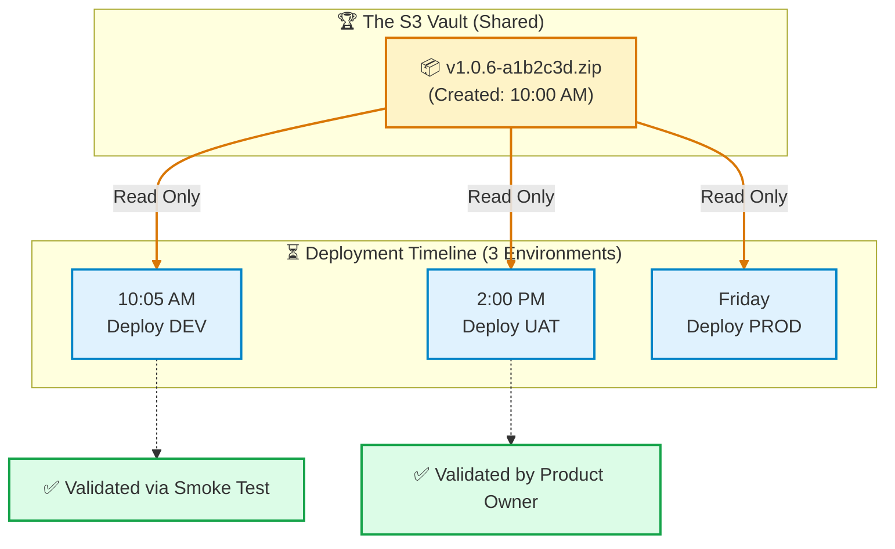
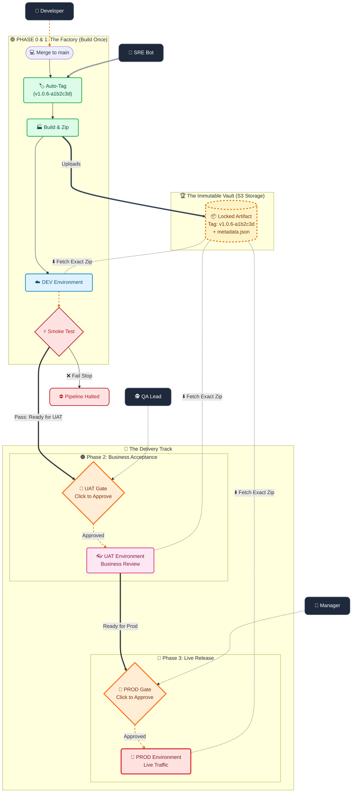
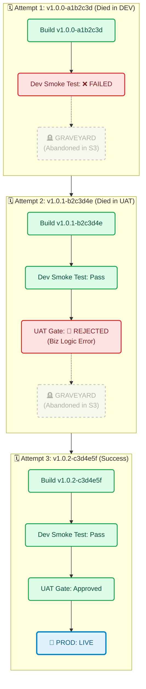

# 📘 Serverless Monorepo: CI/CD Workflow Reference

This document outlines the **Immutable Delivery Pipeline** for our Lambda's Monorepo. We utilize a single Reusable Workflow in the SRE template repository that handles all Setup, Testing, Building, and Deploying logic.

## 🤝 [The Developer Contract](./developers-contract.md)

The Dev team only needs to promise one thing:

> *"My code lives in `functions/<service-name>` and I have a `package.json` script."*

## 📋 Master Lifecycle (Who Does What?)

| Phase | Actor | Action | Outcome |
| :--- | :--- | :--- | :--- |
| **0. Auto-Tag** | **🤖 SRE Bot** | Listens for merge to `main`. | **Calculates Version.** Bumps semantic version, appends Git SHA (e.g., `v1.0.6-a1b2c3d`), and pushes the tag to trigger the pipeline. |
| **1. Factory (CI)** | **⚙️ GitLab** | Detects new release tag. | **Artifact Created.** GitLab builds the zip, uploads it to the S3 Vault, and deploys it to DEV for immediate smoke testing. |
| **2. UAT (Accept)** | **👓 PO / QA Lead** | Validates business logic in UAT. | **Gate Approval.** After DEV passes, the pipeline pauses. The Lead clicks **"Approve"** to unlock UAT. Code is pulled directly from the Vault. |
| **3. Production** | **💼 Manager** | Reviews UAT feedback & Approves. | **Live Release.** Manager clicks **"Approve"** on the PROD Gate in GitLab. The system updates Production Lambdas with the *exact same* zip. |

## 🏆 The Correct Structure (The "Vault")

We use S3 Prefixes (Folders) to organize everything in a single, secure bucket.

**We tag the Artifact, not the Environment.**

```text
s3://aznt-3dc-lambda-artifacts-bkt/
├── configurations/
│   ├── v1.0.6-a1b2c3d/                    <-- The Tag + SHA (The "Box")
│   │   ├── configurations-v1.0.6-a1b2c3d.zip  <-- The Immutable Artifact
│   │   └── metadata.json                  <-- The Chain of Custody (SBOM)
├── price-fetcher/
│   ├── v1.2.0-b7d2e45/
│   │   ├── price-fetcher-v1.2.0-b7d2e45.zip
│   │   └── metadata.json
```

**The Logic:**

1.  Developer merges code.
2.  The Auto-Tagger creates `v1.0.6-a1b2c3d`.
3.  CI builds the Zips and puts them in the `v1.0.6-a1b2c3d` folder in S3.
4.  **Crucial:** The tag exists *before* Dev, UAT, or Prod are touched.
5.  When we deploy to UAT or PROD, we tell AWS: *"Go get the zips from folder `v1.0.6-a1b2c3d`."*
   
This shows exactly how the single `v1.0.6-a1b2c3d` tag feeds the timeline.


```mermaid
flowchart TD
    %% DEFINITIONS
    classDef bucket fill:#fef3c7,stroke:#d97706,stroke-width:2px;
    classDef env fill:#e0f2fe,stroke:#0284c7,stroke-width:2px;
    classDef tag fill:#dcfce7,stroke:#16a34a,stroke-width:2px;

    %% THE VAULT
    subgraph VAULT ["🏆 The S3 Vault (Shared)"]
        direction TB
        Zip["📦 v1.0.6-a1b2c3d.zip
        (Created: 10:00 AM)"]:::bucket
    end

    %% TIMELINE
    subgraph TIME ["⏳ Deployment Timeline (3 Environments)"]
        direction TB
        
        T1["10:05 AM
        Deploy DEV"]:::env
        T2["2:00 PM
        Deploy UAT"]:::env
        T3["Friday
        Deploy PROD"]:::env
    end

    %% FLOW
    Zip -->|Read Only| T1
    Zip -->|Read Only| T2
    Zip -->|Read Only| T3

    %% ANNOTATIONS
    T1 -.-> Verify1[✅ Validated via Smoke Test]:::tag
    T2 -.-> Verify2[✅ Validated by Product Owner]:::tag
    
    linkStyle 0,1,2 stroke:#d97706,stroke-width:2px;
```

-----

## 📘 The CI/CD Workflow Reference Manual

> **For:** Developers, QA, SREs
> **Purpose:** Defines the exact sequence of events for every stage.

### 🤖 PHASE 0: The Auto-Tagger

  * **Goal:** Remove human error from versioning.
  * **Trigger:** Developer merges Pull Request to `main`.

| Step | Actor | Action | Technical Detail |
| --- | --- | --- | --- |
| **0.1** | **Dev** | Merges Pull Request. | `git push origin main` |
| **0.2** | **SRE Bot** | Calculates Version. | Finds highest tag, bumps patch, and appends Git SHA. |
| **0.3** | **SRE Bot** | Pushes Tag. | Pushes `v1.0.6-a1b2c3d` using Bot Token to trigger Phase 1. |

### 🟢 PHASE 1: The Factory & DEV

  * **Goal:** Verify code integrity, create the Immutable Artifact, and test routing.
  * **Trigger:** The push of the new tag.

| Step | Actor | Action | Technical Detail |
| --- | --- | --- | --- |
| **1.1** | **GitLab** | Dynamic Routing. | Scans `functions/` and generates jobs only for modified Lambdas. |
| **1.2** | **GitLab** | **Builds & Zips.** | Runs `npm run build`. Zips contents of `dist/` folder. |
| **1.3** | **GitLab** | Generates SBOM. | Creates `metadata.json` containing pipeline URL and SHA256 Checksum. |
| **1.4** | **GitLab** | **Uploads to Vault.** | Uploads both files to `s3://.../v1.0.6-a1b2c3d/`. |
| **1.5** | **GitLab** | **Deploys to DEV.** | Calls `aws lambda update-function-code` using the S3 link. |
| **1.6** | **GitLab** | **Smoke Test.** | Dynamically fetches the DEV API Gateway URL and runs `npm run test:smoke`. |
| **1.7** | **System** | Decision Point. | If Smoke Test **PASS** → Proceed to Phase 2.<br><br>If Smoke Test **FAIL** → **STOP PIPELINE.** |

### 🟠 PHASE 2: User Acceptance (UAT)

  * **Goal:** Business stakeholder validation.
  * **Trigger:** Manual Approval in GitLab by QA Lead.

| Step | Actor | Action | Technical Detail |
| --- | --- | --- | --- |
| **2.1** | **QA Lead** | **Sign Off.** | Clicks "Approve" on the UAT Gate in GitLab. |
| **2.2** | **GitLab** | **Deploys to UAT.** | Uses the **EXACT SAME** S3 link (`.../v1.0.6-a1b2c3d.zip`). |
| **2.3** | **PO** | Validation. | Product Owner tests new features in the UAT environment. |
| **2.4** | **Manager** | **Go/No-Go Decision.** | Manager reviews UAT feedback. |

### 🔴 PHASE 3: Production (PROD)

  * **Goal:** Live Release & Compliance.
  * **Trigger:** Manual Approval in GitLab by Manager.

| Step | Actor | Action | Technical Detail |
| --- | --- | --- | --- |
| **3.1** | **Manager** | **Production Approval.** | Manager clicks "Approve" on the **PROD Gate** in GitLab. |
| **3.2** | **GitLab** | **Deploys to PROD.** | Updates Production Lambdas with the exact same `v1.0.6-a1b2c3d.zip`. |

-----


### 📘 The Immutable Delivery Pipeline Reference

This section maps the physical infrastructure of our deployment lifecycle. It is designed to prove to stakeholders that our delivery mechanism is secure, auditable, and mathematically predictable. It visually proves that the S3 Vault is the center of the universe and that no environment compiles its own code.

**Visual Legend:**
* 🟩 **Automated Zone (Green):** The "fast lane." Code moves instantly and without human intervention if tests pass.
* 🟧 **Human Control Zone (Orange):** The pipeline physically stops and waits for an authorized signature (Compliance Gates).
* 🟨 **The Vault (Yellow):** The single source of truth. The artifact here is locked and never changes.
* 🟥 **Automated Brakes (Red):** Safety mechanisms that instantly halt deployments if a failure is detected.


```mermaid
flowchart TD
    %% ==========================================
    %% STYLING DEFINITIONS
    %% ==========================================
    classDef actor fill:#1e293b,stroke:#334155,stroke-width:2px,color:#fff,rx:10,ry:10;
    classDef factory fill:#dcfce7,stroke:#16a34a,stroke-width:2px,color:#064e3b,rx:5,ry:5;
    classDef vault fill:#fef3c7,stroke:#d97706,stroke-width:3px,color:#78350f,rx:5,ry:5,stroke-dasharray: 5 5;
    classDef autoEnv fill:#e0f2fe,stroke:#0284c7,stroke-width:2px,color:#075985,rx:5,ry:5;
    classDef gate fill:#ffedd5,stroke:#f97316,stroke-width:3px,color:#7c2d12,rx:5,ry:5,shape:diamond;
    classDef manualEnv fill:#fce7f3,stroke:#db2777,stroke-width:2px,color:#831843,rx:5,ry:5;
    classDef prodEnv fill:#fee2e2,stroke:#dc2626,stroke-width:3px,color:#7f1d1d,rx:5,ry:5;
    classDef brake fill:#fee2e2,stroke:#b91c1c,stroke-width:2px,rx:10,ry:10,color:#b91c1c;

    %% ==========================================
    %% ACTORS
    %% ==========================================
    Dev[👷 Developer]:::actor
    QALead[🕵️ QA Lead]:::actor
    Manager[💼 Manager]:::actor
    SREBot[🤖 SRE Bot]:::actor

    %% ==========================================
    %% THE CENTRAL VAULT
    %% ==========================================
    subgraph VAULT_ZONE ["🏆 The Immutable Vault (S3 Storage)"]
        Vault[("📦 Locked Artifact<br/>Tag: v1.0.6-a1b2c3d<br/>+ metadata.json")]:::vault
    end

    %% ==========================================
    %% PHASE 0 & 1: THE FACTORY (CI)
    %% ==========================================
    subgraph P1 ["🟢 PHASE 0 & 1: The Factory (Build Once)"]
        direction TB
        Merge(["💻 Merge to main"]) --> Tag["🏷️ Auto-Tag<br/>(v1.0.6-a1b2c3d)"]:::factory
        Tag --> Build["🏭 Build & Zip"]:::factory
        Build --> DevEnv["☁️ DEV Environment"]:::autoEnv
        DevEnv --> SmokeDev{"⚡ Smoke Test"}:::brake
    end

    %% ==========================================
    %% MAIN DELIVERY TRACK (UAT & PROD)
    %% ==========================================
    subgraph TRACK ["🚀 The Delivery Track"]
        direction LR

        %% PHASE 2: BUSINESS GATE
        subgraph P2 ["🟠 Phase 2: Business Acceptance"]
            direction TB
            GateUAT{"🛑 UAT Gate<br/>Click to Approve"}:::gate
            UATEnv["👓 UAT Environment<br/>Business Review"]:::manualEnv
            
            GateUAT -->|Approved| UATEnv
        end

        %% PHASE 3: PRODUCTION
        subgraph P3 ["🔴 Phase 3: Live Release"]
            direction TB
            GatePROD{"🛑 PROD Gate<br/>Click to Approve"}:::gate
            ProdEnv["🚀 PROD Environment<br/>Live Traffic"]:::prodEnv
            
            GatePROD -->|Approved| ProdEnv
        end
    end

    %% ==========================================
    %% CONNECTIONS & FLOW
    %% ==========================================
    Dev --> Merge
    SREBot -.-> Tag
    Build ====>|Uploads| Vault

    %% PULLS from Vault
    Vault -.-|⬇️ Fetch Exact Zip| DevEnv
    Vault -.-|⬇️ Fetch Exact Zip| UATEnv
    Vault -.-|⬇️ Fetch Exact Zip| ProdEnv

    %% Track Progression
    SmokeDev ====>|Pass: Ready for UAT| GateUAT
    UATEnv ====>|Ready for Prod| GatePROD

    %% Human Actors
    QALead -..-> GateUAT
    Manager -..-> GatePROD

    %% Brakes
    SmokeDev -- "❌ Fail Stop" --> Stop1["⛔ Pipeline Halted"]:::brake

    %% ==========================================
    %% STYLING ADJUSTMENTS
    %% ==========================================
    linkStyle 3,4,5,6 stroke:#d97706,stroke-width:2px,stroke-dasharray: 5 5;
    linkStyle 7,8 stroke:#334155,stroke-width:4px;
```

---

### 🗣️ Non-technical explanation of the workflow

When presenting this architecture to non-technical stakeholders, focus entirely on **Risk Reduction**, **Compliance**, and **Time-to-Market**. Use the following narrative points:

**1. "The Vault is the Hero" (Eliminating 'It worked on my machine')**
* *Point to the yellow cylinder in the middle.* * "See this locked box labeled `v1.0.6-a1b2c3d`? This is our Immutable Vault. We build and compile the code exactly once. We never open it, we never re-compile it, and we never change it. Every single environment—from Dev to Production—is just borrowing this exact same box. This mathematically guarantees that the exact code you tested in UAT is the exact code going live in Production."

**2. "The Fast Lane" (Accelerating Time-to-Market)**
* *Point to the green Phase 1 box.*
* "Once a developer finishes their work, our SRE Bot automatically calculates the version and triggers the factory. The code instantly rushes to the DEV environment. If our automated safety checks (the red stop signs) pass, the feature lands on the QA team's desk for UAT testing in minutes, entirely hands-free."

**3. "The Control Gates" (Ensuring Strict Compliance)**
* *Point to the orange diamonds.*
* "Even though the system is highly automated, the pipeline physically stops at these gates. Absolutely nothing deploys to UAT or Production until the designated authority (QA Lead or Product Manager) clicks the 'Approve' button in the system. This action creates a permanent, legally auditable timestamp proving exactly who authorized the deployment."

**4. "The Automated Brakes" (Protecting the Business)**
* *Point to the red 'Smoke Test' diamond and the 'Pipeline Halted' block.*
* "We use a 'Fail Forward' strategy. If a developer writes bad code, our automated brake system detects it in DEV and instantly halts the pipeline. The broken code is abandoned in a 'Graveyard'. It is physically impossible for that broken code to ever reach the UAT testers or our Production customers."

**5. "The Chain of Custody" (Proving Zero Trust)**
* *Point to the `metadata.json` text in the Vault.*
* "Every release is digitally signed with a cryptographic checksum (SHA256) and a Software Bill of Materials. If an auditor ever asks, 'Prove to me exactly where the code running in Production came from,' we can hand them this file. It links perfectly back to the exact developer commit, the pipeline that ran it, and the exact timestamp it was approved."

***

## 🪦 The Release Graveyard

This logic demonstrates the **"Fail Forward"** strategy. We do not patch broken releases; we abandon them in the **"Graveyard"** and create new ones.

  * **Attempt 1 (`v1.0.0-a1b2c3d`):** The code compiled, but the automated Smoke Test failed against the DEV API Gateway. The pipeline halted. The artifact sits securely in S3 (the "Graveyard") for forensic analysis but is physically prevented from reaching UAT.
  * **Attempt 2 (`v1.0.1-b2c3d4e`):** A developer fixed the bug. It passed the DEV Smoke Test. However, during UAT, the Product Owner rejected the deployment due to a business logic error. This version is also dead.
  * **Attempt 3 (`v1.0.2-c3d4e5f`):** The logic was corrected. It passed DEV, was approved in UAT, and was finally approved for PROD deployment.

**Why this is great for Auditors:**
It proves **Negative Testing**. If asked to show evidence that bad code is blocked, we point to the halted `v1.0.0` pipeline. The system detected a failure in DEV and physically prevented the code from reaching higher environments.

It perfectly visualizes the "Fail Forward" strategy and demonstrates how the `npm run test:smoke` automated brake physically protects the QA team from receiving broken code.


```mermaid
flowchart TD
    %% ==========================================
    %% STYLING
    %% ==========================================
    classDef success fill:#dcfce7,stroke:#16a34a,stroke-width:2px,color:#064e3b,rx:5,ry:5;
    classDef fail fill:#fee2e2,stroke:#dc2626,stroke-width:2px,color:#7f1d1d,rx:5,ry:5;
    classDef active fill:#e0f2fe,stroke:#0284c7,stroke-width:3px,color:#075985,rx:5,ry:5;
    classDef dead opacity:0.6,fill:#f3f4f6,stroke:#9ca3af,stroke-width:2px,stroke-dasharray: 5 5;

    %% ==========================================
    %% ATTEMPT 1
    %% ==========================================
    subgraph V1 ["🗓️ Attempt 1: v1.0.0-a1b2c3d (Died in DEV)"]
        direction TB
        B1[Build v1.0.0-a1b2c3d]:::success --> D1["Dev Smoke Test: ❌ FAILED"]:::fail
        D1 -.-> G1("🪦 GRAVEYARD<br/>(Abandoned in S3)"):::dead
    end

    %% ==========================================
    %% ATTEMPT 2
    %% ==========================================
    subgraph V2 ["🗓️ Attempt 2: v1.0.1-b2c3d4e (Died in UAT)"]
        direction TB
        B2[Build v1.0.1-b2c3d4e]:::success --> D2[Dev Smoke Test: Pass]:::success
        D2 --> U2["UAT Gate: 🛑 REJECTED<br/>(Biz Logic Error)"]:::fail
        U2 -.-> G2("🪦 GRAVEYARD<br/>(Abandoned in S3)"):::dead
    end

    %% ==========================================
    %% ATTEMPT 3
    %% ==========================================
    subgraph V3 ["🗓️ Attempt 3: v1.0.2-c3d4e5f (Success)"]
        direction TB
        B3[Build v1.0.2-c3d4e5f]:::success --> D3[Dev Smoke Test: Pass]:::success
        D3 --> U3[UAT Gate: Approved]:::success
        U3 --> P3["🚀 PROD: LIVE"]:::active
    end

    %% Connect the attempts to show sequence
    V1 --> V2 --> V3
```
