## 📘 10. CI/CD Workflow Reference

**The Correct Structure (The "Vault"):**
We use **S3 Prefixes (Folders)** to organize everything in a single, secure bucket.

```text
s3://my-org-artifacts-vault/
├── v1.0.0/                        <-- The Tag (The "Box")
│   ├── price-fetcher.zip          <-- The Immutable Artifact
│   └── config-service.zip
├── v1.0.1/
│   ├── price-fetcher.zip
│   └── config-service.zip

```

* **The Logic:**
1. Developer merges code.
2. CI System says: "This is Release `v1.0.0`".
3. It builds the Zips and puts them in the `v1.0.0` folder in S3.
4. **Crucial:** The tag exists *before* Dev, QA, or Prod are touched.
5. When we deploy to QA, we tell AWS: *"Go get the zips from folder `v1.0.0`."*
6. When we deploy to Prod, we tell AWS: *"Go get the zips from folder `v1.0.0`."*

**We tag the Artifact, not the Environment.**

---

### 📘 The CI/CD Workflow Reference Manual

> **For:** Developers, QA, SREs
> **Purpose:** Defines the exact sequence of events for every stage.

#### 🟢 PHASE 1: The Factory (CI & Dev)

* **Goal:** Verify code integrity and create the Immutable Artifact.
* **Trigger:** Push to `main` branch.

| Step | Actor | Action | Technical Detail |
| --- | --- | --- | --- |
| **1.1** | **Dev** | Merges Pull Request. | `git push origin main` |
| **1.2** | **GitHub** | Calculates Version. | Detects `fix:` or `feat:`. Bumps version (e.g., `v1.0.0`). |
| **1.3** | **GitHub** | **Builds & Zips.** | Runs `npm run build`. Zips `dist/` folder. |
| **1.4** | **GitHub** | **Uploads to Vault.** | Uploads to `s3://vault/v1.0.0/service.zip`. |
| **1.5** | **GitHub** | **Deploys to DEV.** | Calls `aws lambda update-function-code` using the S3 link. |
| **1.6** | **GitHub** | **Smoke Test.** | Runs `verify-deployment.ts` against Dev API. |
| **1.7** | **System** | Decision Point. | If Smoke Test **PASS** → Proceed to Phase 2.<br>

<br>If Smoke Test **FAIL** → **STOP PIPELINE.** |

#### 🟡 PHASE 2: Quality Assurance (QA)

* **Goal:** Verify business logic functionality.
* **Trigger:** Automatic (immediately after Phase 1 success).

| Step | Actor | Action | Technical Detail |
| --- | --- | --- | --- |
| **2.1** | **GitHub** | **Deploys to QA.** | Uses the **EXACT SAME** S3 link (`s3://vault/v1.0.0/service.zip`). |
| **2.2** | **GitHub** | Smoke Test. | Runs `verify-deployment.ts` against QA API. |
| **2.3** | **QA Team** | Notification. | Slack/Email alert: "v1.0.0 is live in QA." |
| **2.4** | **QA Team** | **Manual/Auto Testing.** | QA runs Selenium/Cypress suites. |
| **2.5** | **QA Lead** | **Sign Off.** | If satisfied, QA Lead clicks "Approve" in GitHub for the UAT Gate. |

#### 🟠 PHASE 3: User Acceptance (UAT)

* **Goal:** Business stakeholder validation.
* **Trigger:** Manual Approval by QA Lead.

| Step | Actor | Action | Technical Detail |
| --- | --- | --- | --- |
| **3.1** | **GitHub** | **Deploys to UAT.** | Downloads `v1.0.0` from Vault. Updates UAT Lambdas. |
| **3.2** | **PO** | Validation. | Product Owner tests new features in the UAT environment. |
| **3.3** | **Manager** | **Go/No-Go Decision.** | Manager reviews UAT feedback. |
| **3.4** | **Manager** | **Production Approval.** | Manager clicks "Approve" on the **PROD Gate** in GitHub. |

#### 🔴 PHASE 4: Production (PROD)

* **Goal:** Live Release & Compliance.
* **Trigger:** Manual Approval by Manager.

| Step | Actor | Action | Technical Detail |
| --- | --- | --- | --- |
| **4.1** | **GitHub** | **Deploys to PROD.** | Updates Production Lambdas with `v1.0.0`. |
| **4.2** | **GitHub** | Smoke Test. | Runs `verify-deployment.ts` (Safe Read-Only checks) on Prod. |
| **4.3** | **GitHub** | **Triggers DR Sync.** | Fires the `workflow_run` event ("Prod Success"). |

#### 💾 PHASE 5: Disaster Recovery (DR)

* **Goal:** Maintain RTO (Recovery Time Objective).
* **Trigger:** Async Event (After Prod Success).

| Step | Actor | Action | Technical Detail |
| --- | --- | --- | --- |
| **5.1** | **Robot** | Wakes Up. | `dr-sync.yml` starts. |
| **5.2** | **Robot** | Fetches Artifact. | Downloads `v1.0.0` from the Vault. |
| **5.3** | **Robot** | **Deploys to West.** | Updates `us-west-2` Lambdas. |
| **5.4** | **System** | Audit Log. | Marks Release `v1.0.0` as "Globally Synced". |

---

### 📘 The Immutable Delivery Pipeline Reference

**Visual Legend:**

* 🟩 **Automated Zone:** The "fast lane". Code moves instantly if tests pass.
* 🟧 **Human Control Zone:** The pipeline physically stops and waits for an authorized signature.
* 🟨 **The Vault (S3):** The single source of truth. The artifact here never changes.
* ⬜ **Async/Backup:** Happens in the background without blocking the main flow.

```mermaid
flowchart TD
    %% ==========================================
    %% STYLING DEFINITIONS
    %% ==========================================
    classDef actor fill:#1e293b,stroke:#334155,stroke-width:2px,color:#fff,rx:10,ry:10;
    classDef factory fill:#dcfce7,stroke:#16a34a,stroke-width:2px,color:#064e3b,rx:5,ry:5;
    classDef vault fill:#fef3c7,stroke:#d97706,stroke-width:3px,color:#78350f,rx:5,ry:5,stroke-dasharray: 5 5;
    classDef autoEnv fill:#e0f2fe,stroke:#0284c7,stroke-width:2px,color:#075985,rx:5,ry:5;
    classDef gate fill:#ffedd5,stroke:#f97316,stroke-width:3px,color:#7c2d12,rx:5,ry:5,shape:diamond;
    classDef manualEnv fill:#fce7f3,stroke:#db2777,stroke-width:2px,color:#831843,rx:5,ry:5;
    classDef prodEnv fill:#fee2e2,stroke:#dc2626,stroke-width:3px,color:#7f1d1d,rx:5,ry:5;
    classDef drEnv fill:#f3f4f6,stroke:#6b7280,stroke-width:2px,color:#374151,rx:5,ry:5;
    classDef brake fill:#fee2e2,stroke:#b91c1c,stroke-width:2px,rx:10,ry:10,color:#b91c1c;

    %% ==========================================
    %% ACTORS
    %% ==========================================
    Dev[👷 Developer]:::actor
    QALead[🕵️ QA Lead]:::actor
    Manager[💼 Manager]:::actor

    %% ==========================================
    %% THE CENTRAL VAULT
    %% ==========================================
    subgraph VAULT_ZONE ["🏆 The Immutable Vault (S3 Storage)"]
        Vault[("📦 Locked Artifact<br/>Tag: v1.0.0<br/>Checksum: a1b2c3")]:::vault
    end

    %% ==========================================
    %% PHASE 1: THE FACTORY (CI)
    %% ==========================================
    subgraph P1 ["🟢 PHASE 1: The Factory (Build Once)"]
        direction TB
        Commit(["💻 Push Code"]) --> Build["🏭 Build & Tag v1.0.0"]:::factory
        Build --> Upload["⬆️ Upload to Vault"]:::factory
    end

    %% ==========================================
    %% MAIN DELIVERY TRACK
    %% ==========================================
    subgraph TRACK ["🚀 The Delivery Track"]
        direction LR

        %% PHASE 2: AUTOMATED TRAIN
        subgraph P2 ["Phase 2: Automated Validation"]
            direction TB
            DevEnv["☁️ DEV Environment"]:::autoEnv
            SmokeDev{"⚡ Smoke Test"}:::brake
            QAEnv["☁️ QA Environment"]:::autoEnv
            SmokeQA{"⚡ Smoke Test"}:::brake
            
            DevEnv --> SmokeDev
            SmokeDev -->|✅ Pass| QAEnv
            QAEnv --> SmokeQA
        end

        %% PHASE 3: BUSINESS GATE
        subgraph P3 ["Phase 3: Business Acceptance"]
            direction TB
            GateUAT{"🛑 QA Gate<br/>Click to Approve"}:::gate
            UATEnv["👓 UAT Environment<br/>Feature Review"]:::manualEnv
            
            GateUAT -->|Approved| UATEnv
        end

        %% PHASE 4: PRODUCTION
        subgraph P4 ["Phase 4: Live Release"]
            direction TB
            GatePROD{"🛑 Compliance Gate<br/>Click to Approve"}:::gate
            ProdEnv["🚀 PROD Environment<br/>US-East Primary"]:::prodEnv
            
            GatePROD -->|Approved| ProdEnv
        end
    end

    %% ==========================================
    %% CONNECTIONS & FLOW
    %% ==========================================
    Dev --> Commit
    Upload ====> Vault

    %% PULLS from Vault
    Vault -.-|⬇️ Fetch v1.0.0| DevEnv
    Vault -.-|⬇️ Fetch v1.0.0| QAEnv
    Vault -.-|⬇️ Fetch v1.0.0| UATEnv
    Vault -.-|⬇️ Fetch v1.0.0| ProdEnv

    %% Track Progression
    SmokeQA ====>|Ready for UAT| GateUAT
    UATEnv ====>|Ready for Prod| GatePROD

    %% Human Actors
    QALead -..-> GateUAT
    Manager -..-> GatePROD

    %% ASYNC DR (Simplified Label)
    ProdEnv -.->|⚡ Trigger Event: Success| DREnv["💾 DR Environment<br/>US-West Backup"]:::drEnv
    Vault -.-|⬇️ Fetch v1.0.0 Async| DREnv

    %% Brakes
    SmokeDev -- "❌ Fail Stop" --> Stop1["⛔ Pipeline Halted"]:::brake
    SmokeQA -- "❌ Fail Stop" --> Stop2["⛔ Pipeline Halted"]:::brake

    %% ==========================================
    %% STYLING ADJUSTMENTS
    %% ==========================================
    linkStyle 3,7,8,9,10 stroke:#d97706,stroke-width:2px,stroke-dasharray: 5 5;
    linkStyle 4,11,12 stroke:#334155,stroke-width:4px;
    linkStyle 15 stroke:#6b7280,stroke-width:2px,stroke-dasharray: 2 2;
```


### How to explain this diagram to a PM or Executive:

1. **The Vault is the Hero:** Point to the yellow cylinder in the middle. "See this box labeled `v1.0.0`? We create it once. We never open it, we never change it. Every environment is just borrowing this exact same box."
2. **The Fast Lane (Green):** "Once a developer pushes code, it automatically rushes to DEV and QA. If our automated safety checks (the red stop signs) pass, it lands on the QA team's desk in minutes."
3. **The Control Gates (Orange Diamonds):** "The pipeline physically stops here. Nothing goes to UAT or Prod until the designated person (QA Lead or Manager) clicks the 'Approve' button in the system. This is our compliance audit trail."
4. **Disaster Recovery is Automatic (Grey):** "When Prod goes live successfully, the system automatically wakes up and syncs our backup site in the background. No human effort required."

### 📊 Visual Reference: The Artifact Journey

This diagram clarifies exactly how **One Bucket** feeds **Five Environments**.

```mermaid
flowchart TD
    %% DEFINITIONS
    classDef bucket fill:#fef3c7,stroke:#d97706,stroke-width:2px;
    classDef env fill:#e0f2fe,stroke:#0284c7,stroke-width:2px;
    classDef tag fill:#dcfce7,stroke:#16a34a,stroke-width:2px;

    %% THE VAULT
    subgraph VAULT ["🏆 The S3 Vault (Shared)"]
        direction TB
        Zip["📦 v1.0.0/app.zip
        (Created: 10:00 AM)"]:::bucket
    end

    %% TIMELINE
    subgraph TIME ["⏳ Deployment Timeline"]
        direction TB
        
        T1["10:05 AM
        Deploy DEV"]:::env
        T2["10:10 AM
        Deploy QA"]:::env
        T3["2:00 PM
        Deploy UAT"]:::env
        T4["Friday
        Deploy PROD"]:::env
    end

    %% FLOW
    Zip -->|Read Only| T1
    Zip -->|Read Only| T2
    Zip -->|Read Only| T3
    Zip -->|Read Only| T4

    %% ANNOTATIONS
    T1 -.-> Verify1[✅ Validated]:::tag
    T2 -.-> Verify2[✅ Validated]:::tag
    T3 -.-> Verify3[✅ Validated]:::tag
    
    linkStyle 0,1,2,3 stroke:#d97706,stroke-width:2px;

```



### ✅ Key Takeaways for the Team

1. **Devs:** You push code. If it passes Dev/QA, your job is done.
2. **QA:** You don't "build" anything. You just approve what's already there.
3. **SREs:** You manage the Vault permissions. You ensure Prod can read from the Vault, but Dev cannot overwrite existing versions in the Vault.

### 🪦 The Release Graveyard Visualization

This diagram demonstrates the **"Fail Forward"** strategy: when `v1.0.0` dies in QA, we don't fix it; we abandon it and create `v1.0.1`.

This view allows your team to audit exactly *where* and *when* specific versions died.

```mermaid

flowchart TD
    %% ==========================================
    %% STYLING
    %% ==========================================
    classDef success fill:#dcfce7,stroke:#16a34a,stroke-width:2px,color:#064e3b,rx:5,ry:5;
    classDef fail fill:#fee2e2,stroke:#dc2626,stroke-width:2px,color:#7f1d1d,rx:5,ry:5;
    classDef active fill:#e0f2fe,stroke:#0284c7,stroke-width:3px,color:#075985,rx:5,ry:5;
    classDef dead opacity:0.6,fill:#f3f4f6,stroke:#9ca3af,stroke-width:2px,stroke-dasharray: 5 5;

    %% ==========================================
    %% ATTEMPT 1
    %% ==========================================
    subgraph V1 ["🗓️ Attempt 1: v1.0.0 (Died in QA)"]
        direction TB
        B1[Build v1.0.0]:::success --> D1[Dev: Pass]:::success
        D1 --> Q1["QA: ❌ FAILED"]:::fail
        Q1 -.-> G1("🪦 GRAVEYARD
        (Abandoned)"):::dead
    end

    %% ==========================================
    %% ATTEMPT 2
    %% ==========================================
    subgraph V2 ["🗓️ Attempt 2: v1.0.1 (Died in UAT)"]
        direction TB
        B2[Build v1.0.1]:::success --> D2[Dev: Pass]:::success
        D2 --> Q2[QA: Pass]:::success
        Q2 --> U2["UAT: 🛑 REJECTED
        (Biz Logic Error)"]:::fail
        U2 -.-> G2("🪦 GRAVEYARD
        (Abandoned)"):::dead
    end

    %% ==========================================
    %% ATTEMPT 3
    %% ==========================================
    subgraph V3 ["🗓️ Attempt 3: v1.0.2 (Success)"]
        direction TB
        B3[Build v1.0.2]:::success --> D3[Dev: Pass]:::success
        D3 --> Q3[QA: Pass]:::success
        Q3 --> U3[UAT: Approved]:::success
        U3 --> P3["🚀 PROD: LIVE"]:::active
    end

    %% Connect the attempts to show sequence
    V1 --> V2 --> V3

```



### How to Read This Dashboard

1. **Row 1 (`v1.0.0`):** The code compiled and worked in Dev. However, the automated tests in QA found a bug. The pipeline stopped. The artifact sits in S3 (the "Graveyard") for forensic analysis but was never promoted further.
2. **Row 2 (`v1.0.1`):** A developer fixed the QA bug. It passed Dev and QA. However, during UAT, the Product Owner realized a feature was wrong (Business Logic). They rejected the deployment. This version is also dead.
3. **Row 3 (`v1.0.2`):** The logic was corrected. It passed every gate (Dev  QA  UAT) and was finally approved for Production.

### 💡 Why this is great for Auditors

Auditors love this because it proves **Negative Testing**:

* *"Show me evidence that you block bad code."*
* *You point to `v1.0.0`:* "Here is the proof. The system detected a failure in QA and physically prevented the code from reaching Production."

---